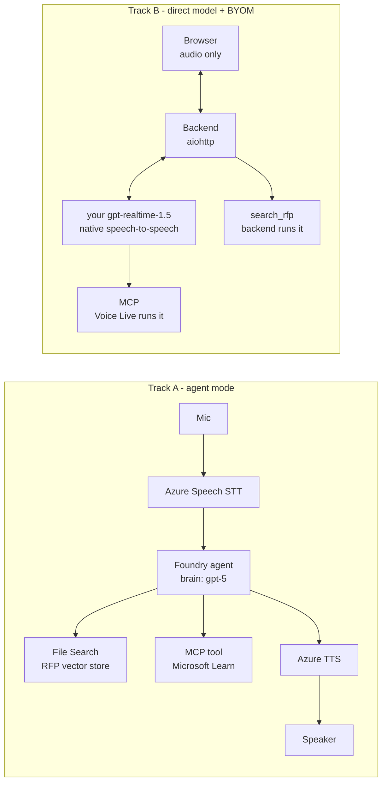

# live-voice-agent-demo

A Foundry voice agent for RFP work, built to answer a specific question:

> When you turn on voice mode for a Foundry agent, which model is actually used —
> and do you have any control over it?

Short answer: **no, not in agent mode.** The agent's chat deployment is the brain and
the audio path is cascaded. Your own `gpt-realtime-1.5` deployment only works in
direct-model mode. The evidence, including the controls that disprove the obvious
first reading, is in [docs/model-control-findings.md](docs/model-control-findings.md).

Because the two capabilities are mutually exclusive today, this repo ships both.

## Two tracks



| | Track A | Track B |
|---|---|---|
| Brain | agent's chat deployment | **your realtime deployment** |
| Audio | cascaded | native speech-to-speech |
| RFP grounding | managed File Search | your backend |
| MCP | Foundry runs it | Voice Live runs it |
| Threads and tracing | Foundry | none |
| Model choice | fixed by agent version | yours |
| Client | Python console | browser, no credentials |

Both tracks get MCP. Only Track A gets managed retrieval; only Track B lets you pick
the model. In Track B the browser only streams microphone audio and plays audio back
— the Entra credential, the Foundry endpoint, the vector store id and the tool
implementations all stay on the backend, which is also the only party holding the
Voice Live socket.

## Setup

```powershell
py -3 -m venv .venv
.\.venv\Scripts\python.exe -m pip install -r requirements.txt

Copy-Item .env.example .env    # then fill it in
az login                        # agent mode is Entra-only, no API keys
```

Required roles on the Foundry resource: **Cognitive Services User** and
**Foundry User**. Add **Foundry Project Manager** to create project connections.

## Run

```powershell
# 1. Gate: is Voice Live reachable from this resource and region?
.\.venv\Scripts\python.exe scripts\probe_voicelive_region.py

# 2. Which voices and models does this region actually accept?
.\.venv\Scripts\python.exe scripts\probe_voice_matrix.py

# 3. The model-control experiments
.\.venv\Scripts\python.exe scripts\probe_model_control.py

# 3b. Who dials out to the MCP server? (does it have to be public?)
.\.venv\Scripts\python.exe scripts\probe_mcp_networking.py

# 3c. A private MCP server: native tool fails, backend function call works
.\.venv\Scripts\python.exe scripts\probe_private_mcp_via_function.py

# 4. Index the RFP corpus, then write VECTOR_STORE_ID into .env
.\.venv\Scripts\python.exe agent\setup_knowledge.py

# 5. Create the agent (File Search + MCP + Voice Live config in metadata)
.\.venv\Scripts\python.exe agent\create_rfp_agent.py

# 6. What is the agent's voice pipeline actually made of?
.\.venv\Scripts\python.exe scripts\probe_agent_session.py

# 7. Check grounding and tool use over text before touching audio
.\.venv\Scripts\python.exe scripts\test_agent_text.py

# 8a. Track A - talk to the agent from the console
.\.venv\Scripts\python.exe agent\voice_live_agent_client.py

# 8b. Track B - start the backend, then open http://localhost:8000
.\.venv\Scripts\python.exe -m backend.server

# Headless checks for Track B (no microphone needed)
.\.venv\Scripts\python.exe scripts\test_tools.py
.\.venv\Scripts\python.exe scripts\test_backend_turn.py
```

## Layout

| Path | Purpose |
|---|---|
| `agent/_common.py` | Settings, and the 512-char metadata chunking Voice Live config needs |
| `agent/audio.py` | PCM16 24 kHz duplex audio, with sequence-numbered playback for barge-in |
| `agent/setup_knowledge.py` | Uploads `data/rfp/` into a vector store |
| `agent/create_rfp_agent.py` | Creates the agent; verifies the voice config round-trips |
| `agent/voice_live_agent_client.py` | Track A console client |
| `backend/tools.py` | `search_rfp` (backend-run) plus the native MCP tool declaration |
| `backend/bridge.py` | One browser session ↔ one Voice Live session, plus tool dispatch |
| `backend/server.py` | aiohttp app: serves the frontend, relays audio over `/ws` |
| `frontend/` | Browser client: mic capture, playback, transcript |
| `scripts/probe_*.py` | Capability probes; `probe_model_control.py` is the important one |
| `scripts/test_*.py` | Grounding, MCP, backend tools, and a full headless voice turn |
| `data/rfp/` | Synthetic tender pack (main document + annexes B, C, D) |
| `docs/model-control-findings.md` | The findings, with evidence |

## Notes

- The RFP corpus is invented. Any resemblance to a real tender is coincidental.
- `require_approval="never"` on the MCP tool is deliberate: a voice call cannot pause
  for an approval round-trip. The allow-list is what keeps it bounded. Reconsider
  this for any tool that writes.
- After `response.mcp_call.completed` the client **must** call `response.create()`.
  Voice Live runs the MCP tool but does not speak the result on its own, so missing
  this makes the turn die silently.
- MCP tool calls sometimes arrive as plain `function_call` items instead. The backend
  proxies unknown tool names to the MCP server so either path works; the cost is that
  a tool can occasionally be invoked twice in one turn.
- `logs/` holds a technical log and a conversation transcript per run. The transcript
  records which agent and voice a session resolved to. Both are gitignored.
- The backend authenticates with `AzureCliCredential`, which is right for a local
  demo and wrong for deployment. Swap it for a managed identity and put real
  authentication in front of `/ws` before this goes anywhere shared.
- One backend process holds one Voice Live session per browser. That is fine for a
  demo; a real deployment needs connection limits and per-user quota.
