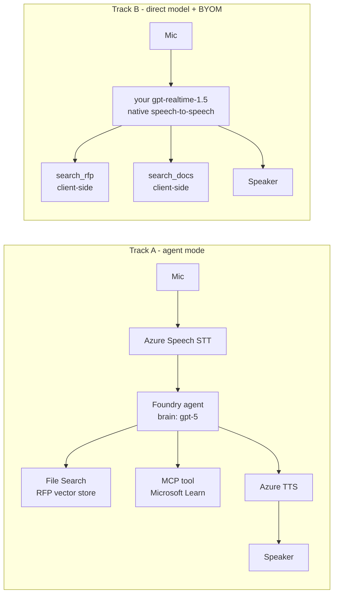

# live-voice-agent-demo

A Foundry voice agent for RFP work, built to answer a specific question:

> When you turn on voice mode for a Foundry agent, which model is actually used —
> and do you have any control over it?

Short answer: **no, not in agent mode.** The agent's chat deployment is the brain and
the audio path is cascaded. Your own `gpt-realtime-1.5` deployment only works in
direct-model mode. The evidence, including the controls that disprove the obvious
first reading, is in [docs/model-control-findings.md](docs/model-control-findings.md).

Because the two capabilities are mutually exclusive today, this repo ships both.

## Two tracks



| | Track A | Track B |
|---|---|---|
| Brain | agent's chat deployment | **your realtime deployment** |
| Audio | cascaded | native speech-to-speech |
| Tools | server-side (File Search, MCP) | client-side function calls |
| Threads and tracing | Foundry | none |
| Model choice | fixed by agent version | yours |

## Setup

```powershell
py -3 -m venv .venv
.\.venv\Scripts\python.exe -m pip install -r requirements.txt

Copy-Item .env.example .env    # then fill it in
az login                        # agent mode is Entra-only, no API keys
```

Required roles on the Foundry resource: **Cognitive Services User** and
**Foundry User**. Add **Foundry Project Manager** to create project connections.

## Run

```powershell
# 1. Gate: is Voice Live reachable from this resource and region?
.\.venv\Scripts\python.exe scripts\probe_voicelive_region.py

# 2. Which voices and models does this region actually accept?
.\.venv\Scripts\python.exe scripts\probe_voice_matrix.py

# 3. The model-control experiments
.\.venv\Scripts\python.exe scripts\probe_model_control.py

# 4. Index the RFP corpus, then write VECTOR_STORE_ID into .env
.\.venv\Scripts\python.exe agent\setup_knowledge.py

# 5. Create the agent (File Search + MCP + Voice Live config in metadata)
.\.venv\Scripts\python.exe agent\create_rfp_agent.py

# 6. Check grounding and tool use over text before touching audio
.\.venv\Scripts\python.exe scripts\test_agent_text.py

# 7a. Track A - talk to the agent
.\.venv\Scripts\python.exe agent\voice_live_agent_client.py

# 7b. Track B - talk to your own realtime deployment
.\.venv\Scripts\python.exe agent\voice_live_byom_client.py
.\.venv\Scripts\python.exe agent\voice_live_byom_client.py --probe-only   # no mic needed
```

## Layout

| Path | Purpose |
|---|---|
| `agent/_common.py` | Settings, and the 512-char metadata chunking Voice Live config needs |
| `agent/audio.py` | PCM16 24 kHz duplex audio, with sequence-numbered playback for barge-in |
| `agent/setup_knowledge.py` | Uploads `data/rfp/` into a vector store |
| `agent/create_rfp_agent.py` | Creates the agent; verifies the voice config round-trips |
| `agent/voice_live_agent_client.py` | Track A client |
| `agent/voice_live_byom_client.py` | Track B client, with client-side RAG and docs search |
| `scripts/probe_*.py` | Capability probes; `probe_model_control.py` is the important one |
| `scripts/test_agent_text.py` | Text-mode assertions for grounding and MCP |
| `data/rfp/` | Synthetic tender pack (main document + annexes B, C, D) |
| `docs/model-control-findings.md` | The findings, with evidence |

## Notes

- The RFP corpus is invented. Any resemblance to a real tender is coincidental.
- `require_approval="never"` on the MCP tool is deliberate: a voice call cannot pause
  for an approval round-trip. The allow-list is what keeps it bounded. Reconsider
  this for any tool that writes.
- `logs/` holds a technical log and a conversation transcript per run. The transcript
  records which agent and voice a session resolved to. Both are gitignored.
