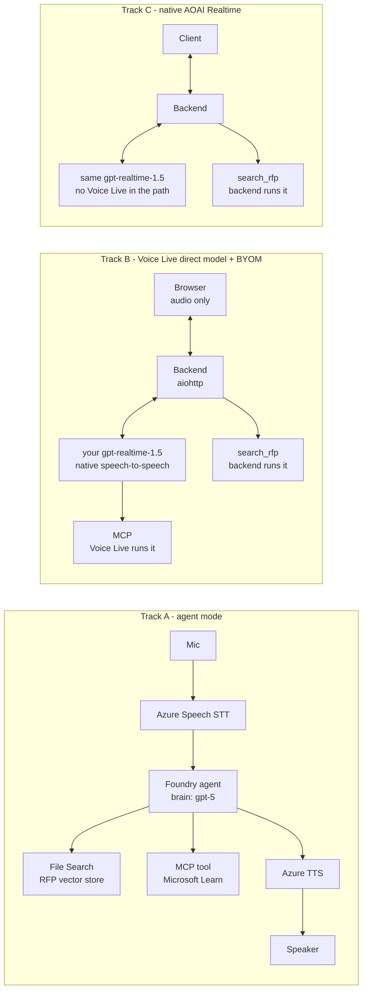

# live-voice-agent-demo

A Foundry voice agent for RFP work, built to answer a specific question:

> When you turn on voice mode for a Foundry agent, which model is actually used —
> and do you have any control over it?

Short answer: **no, not in agent mode.** The agent's chat deployment is the brain and
the audio path is cascaded. Your own `gpt-realtime-1.5` deployment only works in
direct-model mode. The evidence, including the controls that disprove the obvious
first reading, is in [docs/model-control-findings.md](docs/model-control-findings.md).

Because the two capabilities are mutually exclusive today, this repo ships both — plus
a third track that skips Voice Live entirely, as a latency and complexity baseline.

## Three tracks



| | Track A | Track B | Track C |
|---|---|---|---|
| Brain | agent's chat deployment | **your realtime deployment** | your realtime deployment |
| Audio | cascaded | native speech-to-speech | native speech-to-speech |
| Client | Python console | browser, no credentials | script |

In Track B the browser only streams microphone audio and plays audio back — the Entra
credential, the Foundry endpoint, the vector store id and the tool implementations all
stay on the backend, which is also the only party holding the Voice Live socket.

All three answer the same RFP questions from the same corpus, so the differences below
are measured on identical work rather than estimated.

## Comparison

Everything here is measured in this repo, not quoted from a datasheet. Full evidence
and method in [docs/model-control-findings.md](docs/model-control-findings.md).

### Features

| | A · Agent mode | B · Voice Live + BYOM | C · Native AOAI Realtime |
|---|---|---|---|
| Model choice | fixed by agent version, **chat** deployment only | **yours**, via `profile=byom-…` | **yours** |
| Audio path | cascaded STT → LLM → TTS | native speech-to-speech | native speech-to-speech |
| Voices | 600+ Azure Neural, HD, MAI, custom | same, on a realtime model | ❌ model-native only (`alloy`, …) |
| Turn detection | `azure_semantic_vad`, filler-word removal | same | ❌ `server_vad` / `semantic_vad` |
| Noise suppression / echo cancel | ✅ server-side | ✅ server-side | ❌ build it yourself |
| Avatar, visemes, timestamps | ✅ | ✅ | ❌ |
| RAG | **managed File Search** | your backend | your backend |
| MCP, public server | native, Foundry runs it | native, Voice Live runs it | ❌ function call only |
| MCP, private server | ✅ native via VNet | ❌ function-call proxy | ✅ your backend is the client |
| Threads / tracing | **built in** | you build it | you build it |
| Interim "let me check" | ✅ `interim_response` | ❌ | ❌ |

### Latency

`scripts/bench_latency.py --runs 3` — medians, francecentral. Turns are injected as
**text**, so the STT hop is excluded everywhere; that *flatters* the cascaded track.

| Track | first audio | full answer | + retrieval, first audio | + retrieval, complete |
|---|---|---|---|---|
| A · agent, `gpt-5` | 3 920 ms | 3 923 ms | 13 555 ms | 15 325 ms |
| A · agent, `gpt-4o-mini` | 1 415 ms | 1 421 ms | 3 141 ms | 4 316 ms |
| B · Voice Live + BYOM | 406 ms | 416 ms | 1 958 ms | 3 725 ms |
| C · native AOAI Realtime | **363 ms** | **387 ms** | **1 279 ms** | **2 924 ms** |

Cascaded is a different latency class — even on a fast chat model it needs ~1.4 s
before the first syllable. The `gpt-5` figure is a *model* choice, not a cascade tax;
a control agent on `gpt-4o-mini` isolates the two. Voice Live costs ~40–700 ms over
the raw API, which is what Azure voices and semantic VAD are worth.

### Cost

`scripts/probe_cost_signals.py` — one identical turn, same question, same answer.

| Track | total tokens | input | output text | output audio | reasoning | meters |
|---|---|---|---|---|---|---|
| A · agent (`gpt-5`) | **7 207** | 6 324 | 668 | 215 | 576 | Voice Live + agent deployment |
| B · Voice Live + BYOM | 1 865 | 1 639 | 33 | 193 | 0 | **Voice Live + your deployment** |
| C · native AOAI | 1 851 | 1 640 | 50 | 161 | 0 | **your deployment only** |

Agent mode cost ~3.9× the tokens for the same sentence: reasoning tokens, plus a
6 324-token input because File Search injects chunks you cannot trim. B and C meter
almost identically — same model, same work — so the real difference is **how many
bills those tokens generate**. Voice Live's own rate is tiered Pro / Basic / Lite by
model. Audio runs ~10 tokens/s in and ~20 tokens/s out.

⚠️ The BYOM `usage` object is incomplete by design — the docs state LLM token usage is
reported separately — so do not size a deployment from it. Reconcile in Cost Management.

### Enterprise integration

| | A · Agent mode | B · Voice Live + BYOM | C · Native AOAI Realtime |
|---|---|---|---|
| **Residency** of inference | the agent's deployment — `gpt-5` here is **GlobalStandard** | **yours** (Data Zone if you deploy it so) | **yours** |
| Residency trap | Voice Live's *managed* realtime models are Global standard in francecentral | avoided — BYOM points at your SKU | avoided |
| Extra residency surface | Azure STT + TTS legs, in-region by contract | Azure TTS leg, in-region | **none** — one hop |
| **Private network**: data + tools | ✅ VNet + private endpoints | ✅ backend-side | ✅ backend-side |
| **Private network**: the socket | service dials out; WS is public egress | same | **private endpoint** on the AOAI resource |
| **Auth** to the service | **Entra only** | Entra or API key | Entra or API key |
| **Auth** to MCP | Foundry project connection (`oauth2`, `custom-keys`, `user-entra-token`, MI) | `authorization` / `headers` — **you hand a token to the service** | your backend's credential |
| **Auth** to RAG | project connection + MI + private endpoints | backend MI; store id never leaves backend | same as B |
| Setup floor | **Standard setup, VNet, /27 subnet, 3 private endpoints** | Foundry resource + a deployment | an AOAI deployment |

The sharpest line: **A is the only track where a Microsoft service must reach into
your network, and B is the only one where a long-lived secret must leave it.**

### Effort to build

Non-blank lines actually written in this repo:

| | A · Agent mode | B · Voice Live + BYOM | C · Native AOAI Realtime |
|---|---|---|---|
| Code here | ~565 lines | ~913 lines | **~154 lines** |
| What that buys | full voice agent + retrieval + MCP + threads | full browser voice agent | one turn, no UI, no mic |
| Still to build for parity | nothing functional | nothing functional | browser client, barge-in, VAD, noise — most of B's 913 |
| Hardest thing hit | voice config exceeds the 512-char metadata limit, must be chunked | concurrent WS writes corrupt the socket; MCP needs a manual `response.create()` | nothing — behaved as documented |
| Ops burden | lowest | highest | high, and you own voice quality |

The counts invert the usual intuition: **C is the smallest thing to get working and the
largest to get *right***. B's extra ~750 lines are mostly the polish Voice Live gives
you server-side.

### Verdict

| Dimension | Winner | Margin |
|---|---|---|
| Features | **A** | managed retrieval, threads, tracing, native private MCP |
| Latency | **C** | 363 ms vs 406 ms vs 1 415 ms first audio |
| Cost | **C** | one meter; 1 851 tokens vs A's 7 207 for the same sentence |
| Residency | **B / C** | you pick the SKU; A inherits GlobalStandard today |
| Private network | **A** | only native private MCP and VNet-injected tools |
| Auth | **A / C** | credential stays put; B hands a token to the service |
| Effort | **A** | least product code, most Azure configuration |

No track wins twice in the same direction, which is why this is a real decision.
**For this tender: B** — Annex D rules out A on latency, M-01 and Annex C rule out its
GlobalStandard `gpt-5`, and the branded Azure voice is what justifies the premium
over C.

## Setup

```powershell
py -3 -m venv .venv
.\.venv\Scripts\python.exe -m pip install -r requirements.txt

Copy-Item .env.example .env    # then fill it in
az login                        # agent mode is Entra-only, no API keys
```

Required roles on the Foundry resource: **Cognitive Services User** and
**Foundry User**. Add **Foundry Project Manager** to create project connections.

## Run

```powershell
# 1. Gate: is Voice Live reachable from this resource and region?
.\.venv\Scripts\python.exe scripts\probe_voicelive_region.py

# 2. Which voices and models does this region actually accept?
.\.venv\Scripts\python.exe scripts\probe_voice_matrix.py

# 3. The model-control experiments
.\.venv\Scripts\python.exe scripts\probe_model_control.py

# 3b. Who dials out to the MCP server? (does it have to be public?)
.\.venv\Scripts\python.exe scripts\probe_mcp_networking.py

# 3c. A private MCP server: native tool fails, backend function call works
.\.venv\Scripts\python.exe scripts\probe_private_mcp_via_function.py

# 4. Index the RFP corpus, then write VECTOR_STORE_ID into .env
.\.venv\Scripts\python.exe agent\setup_knowledge.py

# 5. Create the agent (File Search + MCP + Voice Live config in metadata)
.\.venv\Scripts\python.exe agent\create_rfp_agent.py

# 6. What is the agent's voice pipeline actually made of?
.\.venv\Scripts\python.exe scripts\probe_agent_session.py

# 7. Check grounding and tool use over text before touching audio
.\.venv\Scripts\python.exe scripts\test_agent_text.py

# 8a. Track A - talk to the agent from the console
.\.venv\Scripts\python.exe agent\voice_live_agent_client.py

# 8b. Track B - start the backend, then open http://localhost:8000
.\.venv\Scripts\python.exe -m backend.server

# 8c. Track C - VoiceRAG on the raw Azure OpenAI Realtime API, no Voice Live
.\.venv\Scripts\python.exe scripts\probe_aoai_realtime_rag.py

# 9. Time all three tracks against Annex D's latency targets
.\.venv\Scripts\python.exe scripts\bench_latency.py --runs 3

# 10. What does each track actually meter?
.\.venv\Scripts\python.exe scripts\probe_cost_signals.py

# Headless checks for Track B (no microphone needed)
.\.venv\Scripts\python.exe scripts\test_tools.py
.\.venv\Scripts\python.exe scripts\test_backend_turn.py
```

## Layout

| Path | Purpose |
|---|---|
| `agent/_common.py` | Settings, and the 512-char metadata chunking Voice Live config needs |
| `agent/audio.py` | PCM16 24 kHz duplex audio, with sequence-numbered playback for barge-in |
| `agent/setup_knowledge.py` | Uploads `data/rfp/` into a vector store |
| `agent/create_rfp_agent.py` | Creates the agent; verifies the voice config round-trips |
| `agent/voice_live_agent_client.py` | Track A console client |
| `backend/tools.py` | `search_rfp` (backend-run) plus the native MCP tool declaration |
| `backend/bridge.py` | One browser session ↔ one Voice Live session, plus tool dispatch |
| `backend/server.py` | aiohttp app: serves the frontend, relays audio over `/ws` |
| `frontend/` | Browser client: mic capture, playback, transcript |
| `scripts/probe_*.py` | Capability probes; `probe_model_control.py` is the important one |
| `scripts/bench_latency.py` | Times all three tracks; text-injected turns, so no STT hop |
| `scripts/test_*.py` | Grounding, MCP, backend tools, and a full headless voice turn |
| `data/rfp/` | Synthetic tender pack (main document + annexes B, C, D) |
| `docs/model-control-findings.md` | The findings, with evidence |

## Notes

- The RFP corpus is invented. Any resemblance to a real tender is coincidental.
- `require_approval="never"` on the MCP tool is deliberate: a voice call cannot pause
  for an approval round-trip. The allow-list is what keeps it bounded. Reconsider
  this for any tool that writes.
- After `response.mcp_call.completed` the client **must** call `response.create()`.
  Voice Live runs the MCP tool but does not speak the result on its own, so missing
  this makes the turn die silently.
- MCP tool calls sometimes arrive as plain `function_call` items instead. The backend
  proxies unknown tool names to the MCP server so either path works; the cost is that
  a tool can occasionally be invoked twice in one turn.
- `logs/` holds a technical log and a conversation transcript per run. The transcript
  records which agent and voice a session resolved to. Both are gitignored.
- The backend authenticates with `AzureCliCredential`, which is right for a local
  demo and wrong for deployment. Swap it for a managed identity and put real
  authentication in front of `/ws` before this goes anywhere shared.
- One backend process holds one Voice Live session per browser. That is fine for a
  demo; a real deployment needs connection limits and per-user quota.
