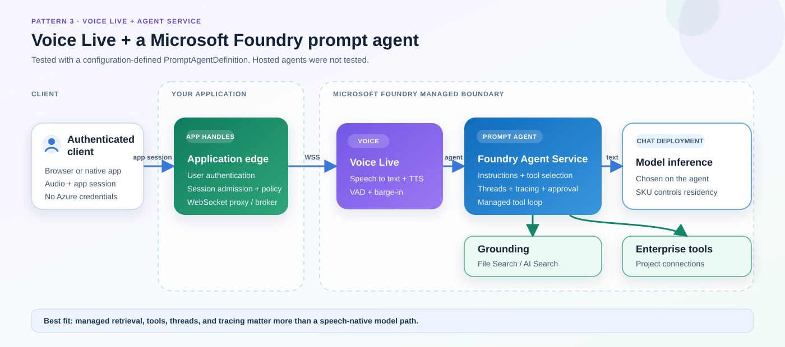
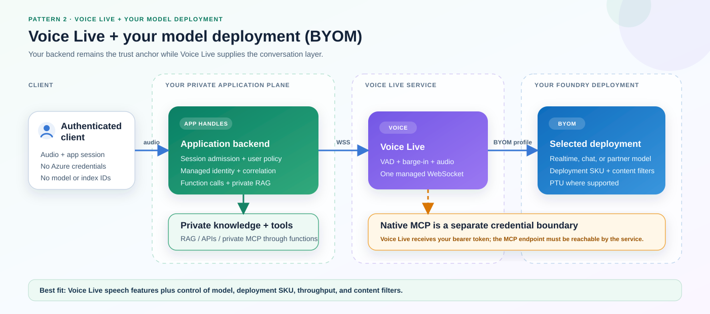
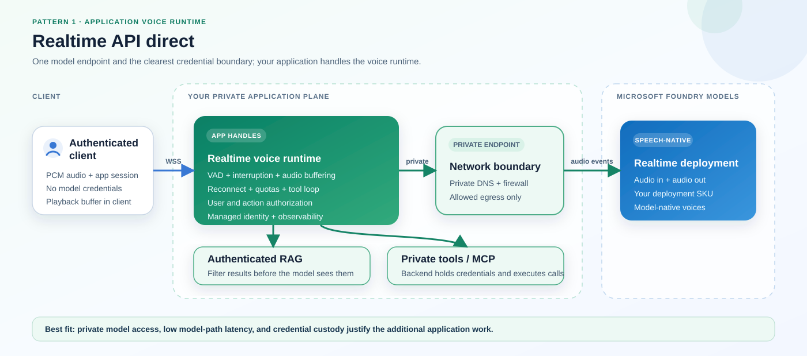
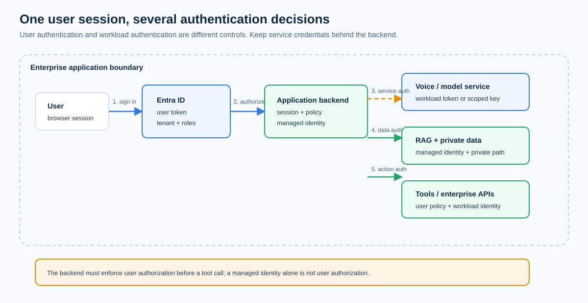
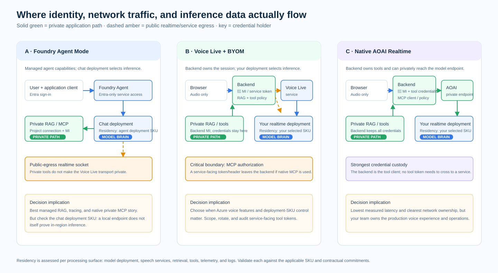
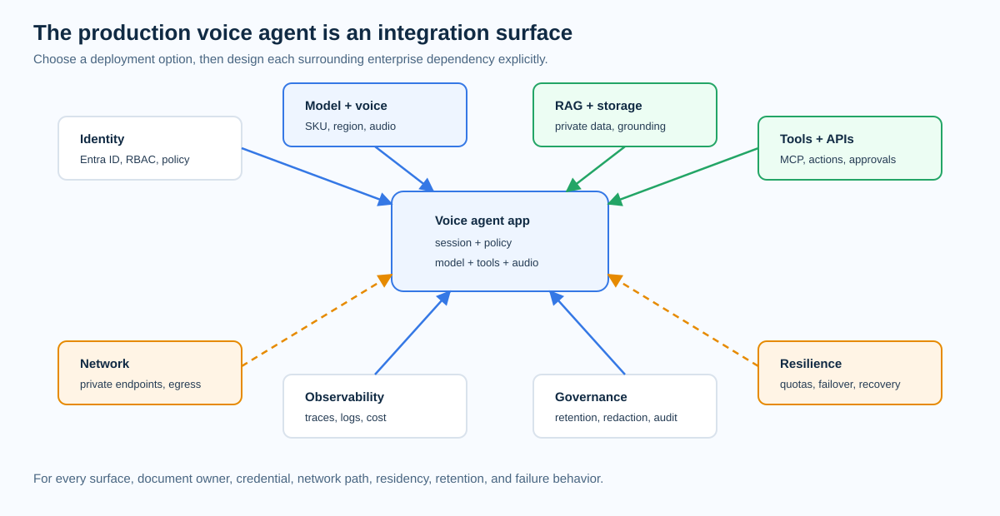
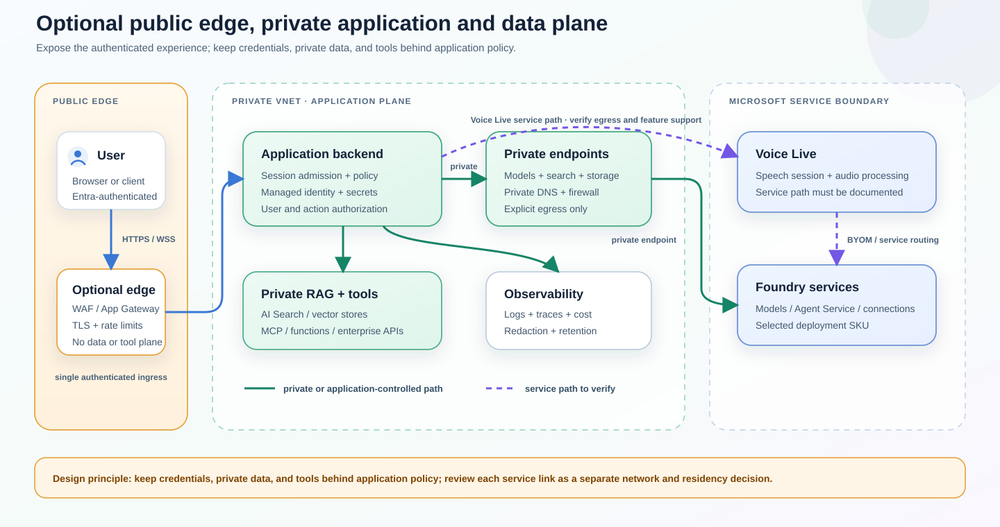

# Production-grade voice agents on Azure: three deployment options

A voice agent has to do four things at once: hear the user, think, speak, and reach
enterprise data and tools. Azure gives you at least three credible places to put that
responsibility, and the choice is not a feature comparison — it is a decision about
which boundaries you are willing to own.

This repository builds the *same* voice agent three times against a synthetic tender
pack (RFP-2026-014), then measures the difference.

**TL;DR**

| | [Voice Live + Foundry prompt agent](#option-1--voice-live--foundry-prompt-agent) | [Voice Live + BYOM](#option-2--voice-live--byom) | [Native Realtime](#option-3--native-azure-openai-realtime) |
|---|---|---|---|
| You own | The client | The session + tools | Everything except the model |
| Voice pipeline | Managed, cascaded (STT → chat → TTS) | Managed, speech-native | Yours to build |
| Model choice | Chat deployment | Your realtime deployment | Your realtime deployment |
| Warm first-audio (no tool, n=10, [caveats](#latency-what-was-actually-measured)) | ~4.4 s (`gpt-5`) / ~1.7 s (`gpt-4o-mini`) | ~0.42 s | ~0.34 s |
| Best when | Managed capability matters most | Voice features *and* model control | Credential and network control matters most |

The short version: **a Foundry prompt agent trades response time for managed capability.** Most of
that gap is model choice — a non-reasoning chat model cuts it from ~4.4 s to ~1.7 s — but
about a second remains in the measured chat-completion + TTS path, before adding the STT
hop excluded by this text-injected test. If you need
both managed voice and a controlled model deployment, Voice Live + BYOM is the balanced
option — but see [how that conclusion is derived](#choosing-an-option), because it is
workload-specific.

> **Scope.** This repo is a local reference implementation, not production
> infrastructure. It runs on the signed-in developer identity and deploys no WAF, VNet,
> private DNS, private endpoint, or user authentication. The production diagrams
> throughout are *reference patterns*, explicitly separated from what the demo
> implements — see [What this repository actually implements](#what-this-repository-actually-implements).

---

## Contents

- [The conceptual model](#the-conceptual-model)
- [What this repository actually implements](#what-this-repository-actually-implements)
- [Choosing an option](#choosing-an-option)
- [Option 1 — Voice Live + Foundry prompt agent](#option-1--voice-live--foundry-prompt-agent)
- [Option 2 — Voice Live + BYOM](#option-2--voice-live--byom)
- [Option 3 — Native Azure OpenAI Realtime](#option-3--native-azure-openai-realtime)
- [Cross-cutting integration views](#cross-cutting-integration-views)
- [Reference topology: public front, private enterprise plane](#reference-topology-public-front-private-enterprise-plane)
- [Enterprise constraints shared by all options](#enterprise-constraints-shared-by-all-options)
- [Latency: what was actually measured](#latency-what-was-actually-measured)
- [Run the demos](#run-the-demos)
- [Repository contracts and schemas](#repository-contracts-and-schemas)
- [Production readiness checklist](#production-readiness-checklist)
- [Sources and reproducibility](#sources-and-reproducibility)

---

## The conceptual model

Every voice agent is the same four jobs. What changes between the three options is
*who performs each one*.

| Job | What it means | Azure component |
|---|---|---|
| **Ears** | Detect that someone is speaking, decide when they stopped, transcribe | Voice Live turn detection + STT, or the realtime model itself |
| **Brain** | Decide what to say and which tool to call | A chat deployment (prompt agent) or a realtime deployment (BYOM / Native) |
| **Mouth** | Turn the answer into audio, and stop instantly on interruption | Azure TTS voices (Voice Live) or model-native voices (Realtime) |
| **Reach** | Retrieval over your corpus, plus enterprise tools | File Search over a vector store, function tools, MCP servers |

Three products can supply these, and they are easy to confuse:

- **[Microsoft Foundry Agent Service](https://learn.microsoft.com/en-us/azure/ai-foundry/agents/overview)** —
  a managed prompt agent: instructions, tool definitions, threads, and
  [File Search](https://learn.microsoft.com/en-us/azure/ai-foundry/agents/how-to/tools/file-search)
  retrieval. It has no voice of its own.
- **[Voice Live API](https://learn.microsoft.com/en-us/azure/ai-services/speech-service/voice-live)** —
  the speech layer: turn detection, noise suppression, echo cancellation, STT, and Azure
  TTS voices over a single WebSocket. It can drive *either* a Foundry prompt agent
  ([agent mode](https://learn.microsoft.com/en-us/azure/ai-services/speech-service/voice-live-agents-quickstart))
  *or* your own model deployment
  ([BYOM](https://learn.microsoft.com/en-us/azure/ai-services/speech-service/how-to-bring-your-own-model)).
- **[Azure OpenAI Realtime API](https://learn.microsoft.com/en-us/azure/ai-foundry/openai/how-to/realtime-audio)** —
  a speech-to-speech model endpoint with no managed voice platform around it. You get the
  model socket; the voice experience is yours to build.

The decisive architectural difference is **where audio is converted**:

```
Prompt agent    mic → Voice Live (STT) → chat deployment → Voice Live (TTS) → speaker
                       └── cascaded: three hops, each adding latency ──┘

BYOM            mic → Voice Live ──────→ your realtime deployment ─────→ speaker
                       └── speech-native model, managed voice features ──┘

Native Realtime mic → your backend ────→ your realtime deployment ─────→ speaker
                       └── you own VAD, buffering, barge-in, playback ───┘
```

The prompt-agent path is **cascaded**: the chat model never sees audio, so a reasoning-heavy chat
deployment pays its full think time before TTS can start. That single fact explains most
of the [latency gap](#latency-what-was-actually-measured).

### Where tools execute

This is the second thing that differs, and it is a security boundary, not a detail.

| Path | Who executes the tool | Credential lives |
|---|---|---|
| Prompt agent + File Search / MCP | Foundry Agent Service | In the Foundry project connection |
| BYOM + function tool (`search_rfp`) | Your backend | Your backend only |
| BYOM + native MCP (`"type": "mcp"`) | Voice Live service | Passed **to the service** |
| Native Realtime | Your backend | Your backend only |

A function tool round-trips to your code, so you can authorize per user and per action.
A natively declared MCP server is dialled by the service, which means any authorization
it needs crosses a service boundary. Both are legitimate; they are not interchangeable.
See [Tool execution: two patterns](#tool-execution-two-patterns).

---

## What this repository actually implements

The demo and the production diagrams are deliberately different things. This table is
the honest version.

| Capability | Foundry prompt agent | BYOM | Native Realtime |
|---|---|---|---|
| Spoken conversation | ✅ console client | ✅ browser app | ⚠️ headless probe only |
| Barge-in / interruption | ✅ | ✅ | ❌ not implemented |
| RFP retrieval | ✅ managed File Search | ✅ backend `search_rfp` | ✅ backend `search_rfp` |
| Microsoft Learn MCP | ✅ Foundry-executed | ✅ service + backend proxy | ❌ |
| Browser UI | ❌ console only | ✅ | ❌ |
| Entra ID user auth | ❌ developer identity (`az login`) | ❌ | ❌ |
| Managed identity | ❌ | ❌ | ❌ |
| Private endpoints / VNet | ❌ | ❌ | ❌ |

Legend: ✅ implemented and exercised · ⚠️ partial · ❌ not implemented, production concern only.

**Option 3 is a verification client, not an application.** It proves the native Realtime
path can do grounded RAG with audio out, and it measures the model-leg latency. It does
not implement mic capture, VAD, or barge-in. Its production diagram below shows what you
*would* build, not what is in this repo.

The demo's real topology is one machine:

```
console client ─┐
                ├─→ Voice Live / Azure OpenAI ─→ your Foundry project
browser ─→ backend (localhost:8000)
```

There is no gateway, no VNet, and `backend.server` is **unauthenticated**. Bind it to
loopback and never expose it.

---

## Choosing an option

Feature counts do not decide this. Hard gates do. Work down the list and stop at the
first row that is non-negotiable for your workload.

| Hard gate | Foundry prompt agent | BYOM | Native Realtime |
|---|---|---|---|
| Model deployment and SKU must be yours (residency) | ✅ chat deployment selected on the agent | ✅ | ✅ |
| No tool credential may leave your backend | ⚠️ Foundry executes tools | ✅ with function tools | ✅ |
| Model endpoint must be reachable privately | ⚠️ verify per connection | ⚠️ Voice Live is an added surface | ✅ clearest story |
| Sub-second first audio | ❌ ~1.7 s even on a fast chat model | ✅ ~0.42 s | ✅ ~0.34 s |
| Branded Azure TTS voice, managed VAD/barge-in | ✅ | ✅ | ❌ build it yourself |
| Managed threads, tracing, retrieval, fastest delivery | ✅ | ⚠️ partial | ❌ |
| Smallest application surface to operate | ✅ | ⚠️ | ❌ |

**How to read it.** If strict residency *and* sub-second audio are both mandatory, the
prompt-agent path is eliminated on latency and the choice is BYOM vs Native. If you additionally need
Azure branded voices and managed turn detection, Native is eliminated and BYOM is what
remains. If instead your gate is "no credential may ever cross a service boundary and the
model endpoint must be private", Native wins and you accept building the voice platform.

**For the RFP workload in this repo** — EU-residency-sensitive tender data, a branded
assistant persona, interactive latency, and a small team — the binding gates are
residency, voice quality, and latency. That eliminates the prompt-agent path on latency and Native on
voice-platform cost, leaving **Voice Live + BYOM**. Native Realtime remains the right
answer the moment the credential boundary becomes the top gate, despite it being the
faster of the two.

That conclusion is workload-specific. Revalidate it against your region, SKU
availability, security policy, and operating model.

---

## Option 1 — Voice Live + Foundry prompt agent

Use the managed agent experience when retrieval, threads, tracing, MCP integration, and
speed of delivery matter more than control of the voice and model path.

> **Scope.** This demo creates a configuration-defined **prompt agent** with
> `PromptAgentDefinition`. It does not test Foundry **Hosted agents**, which run custom
> agent code. Do not generalize this demo's latency or cost results to Hosted agents.

<p align="center"></p>

**How it works here.** [`agent/create_rfp_agent.py`](agent/create_rfp_agent.py) publishes an
agent version carrying three things: a chat model, its tools, and — unusually — the Voice
Live *session* configuration, stored as agent metadata. At connection time Voice Live reads
that metadata, so [`agent/voice_live_agent_client.py`](agent/voice_live_agent_client.py)
never sends a voice or turn-detection setting. See
[Agent definition](#3-agent-definition-agentcreate_rfp_agentpy) and
[Voice Live config in agent metadata](#4-voice-live-session-config-in-agent-metadata).

### Enterprise integration

- **Identity:** users authenticate to your application with Entra ID. Foundry reaches
  models, retrieval, and tools through a project connection and
  [managed identity or another supported identity mode](https://learn.microsoft.com/en-us/azure/ai-services/authentication).
  Note that you still need a backend to host browser sessions — managed orchestration
  does not remove that.
- **Networking:** put retrieval stores and private tools behind private endpoints or
  [supported VNet integration](https://learn.microsoft.com/en-us/azure/ai-foundry/agents/how-to/virtual-networks).
  Validate the managed service's outbound path separately.
- **Residency:** the chat deployment's
  [deployment type and SKU](https://learn.microsoft.com/en-us/azure/ai-foundry/foundry-models/concepts/deployment-types)
  determines where inference happens. A regional Foundry resource is not, by itself,
  proof of in-region inference.
- **Controls:** project-level RBAC, tool allow-lists, per-user authorization,
  [tracing](https://learn.microsoft.com/en-us/azure/ai-foundry/agents/concepts/tracing),
  audit logging, and transcript retention policy.

**Best fit:** a managed enterprise agent with the lowest application ownership.

**Constraint:** the platform owns more of the orchestration and the service-to-tool
boundary, so model, network, and residency decisions must be verified at the SKU and
connection level. The cascaded pipeline also sets a latency floor.

---

## Option 2 — Voice Live + BYOM

Use [bring-your-own-model](https://learn.microsoft.com/en-us/azure/ai-services/speech-service/how-to-bring-your-own-model)
when you need managed voice capabilities *and* must select the realtime model deployment
or residency SKU yourself.

<p align="center"></p>

**How it works here.** [`backend/bridge.py`](backend/bridge.py) holds one Voice Live
session per browser and routes inference to your own deployment with a
`profile=byom-...` query parameter. The browser gets audio and transcripts and nothing
else — no Azure credential, no endpoint, no vector store id. See
[BYOM connection](#5-byom-connection-backendbridgepy) and the
[browser protocol](#7-browser--backend-protocol).

### Enterprise integration

- **Identity:** the browser receives an authenticated application session, not Azure
  credentials. The backend uses managed identity or workload identity for Azure services.
- **Networking:** keep retrieval, storage, and private tools behind the backend's private
  network. Voice Live is an *additional* managed surface — document its service path and
  required egress separately, and note that
  [Speech private link](https://learn.microsoft.com/en-us/azure/ai-services/speech-service/speech-services-private-link)
  support must be confirmed for the specific feature you use.
- **Residency:** your realtime deployment and its SKU control model inference, while
  Voice Live remains a separate processing surface with its own
  [regional availability](https://learn.microsoft.com/en-us/azure/ai-services/speech-service/regions)
  and service terms.
- **Tools:** backend function-call proxies are the safer default for sensitive or private
  tools. If you use [native service-side MCP](https://learn.microsoft.com/en-us/azure/ai-services/speech-service/how-to-voice-live-mcp-server),
  pass only short-lived, narrowly scoped authorization and audit that boundary.
- **Operations:** you own session admission, user policy, quotas, connection limits,
  reconnect behaviour, correlation IDs, and cost attribution across two services.

**Best fit:** a branded or managed voice experience with a controlled realtime model.

**Constraint:** multiple service boundaries — including a credential boundary that must
be designed deliberately if you use service-side MCP.

---

## Option 3 — Native Azure OpenAI Realtime

Use the [Realtime API over WebSockets](https://learn.microsoft.com/en-us/azure/ai-foundry/openai/how-to/realtime-audio-websockets)
when private model access, credential custody, low latency, and application control
outweigh the engineering effort.

<p align="center"></p>

**How it works here.** [`scripts/probe_aoai_realtime_rag.py`](scripts/probe_aoai_realtime_rag.py)
connects straight to `wss://<resource>.openai.azure.com`, injects a text turn, executes
`search_rfp` in-process, returns the result, and counts the audio that comes back. The
diagram above is the architecture you would build around it; the probe itself is
headless. See [Native Realtime session](#8-native-realtime-session-scriptsprobe_aoai_realtime_ragpy).

### Enterprise integration

- **Identity:** users authenticate to your application; the backend authenticates to
  Azure OpenAI, retrieval, and tools with managed identity or workload identity.
- **Networking:** use a [private endpoint](https://learn.microsoft.com/en-us/azure/ai-foundry/how-to/configure-private-link)
  for Azure OpenAI where required. All tool and retrieval calls stay in the backend's
  private network and credentials never reach the browser. This is the clearest private
  model-endpoint story of the three.
- **Residency:** you select and validate the realtime deployment SKU and its
  [processing commitments](https://learn.microsoft.com/en-us/azure/ai-foundry/responsible-ai/openai/data-privacy).
- **Tools:** the backend is the function-call or MCP client, so it can enforce user and
  action authorization before every invocation.
- **Operations:** you own audio capture, VAD, interruption, playback buffering,
  reconnects, scaling, failover, observability, and retention. Voices are
  [model-native](https://learn.microsoft.com/en-us/azure/ai-foundry/openai/realtime-audio-reference)
  (`alloy`, …), not Azure TTS voices — branded neural voices are not available here.

**Best fit:** strict network and credential boundaries, low latency, maximum control.

**Constraint:** the most voice-platform work becomes your application's job.

---

## Cross-cutting integration views

The option diagrams show where each architecture places responsibility. These views show
the enterprise controls that apply regardless of which option you pick.

### Authentication flow

<p align="center"></p>

The distinction that matters is between the **user's token** and the **application's
workload identity**. Authorize the user *before* a session opens, then use a
least-privilege workload identity for Azure services. Tool authorization has to consider
both: a workload that is allowed to call an API does not mean *this* user is allowed to
trigger *this* action.

### Trust boundaries

<p align="center"></p>

Where the realtime socket sits relative to your network perimeter differs per option.
Treat the private/public labelling in this diagram as a **design assumption to verify**,
not a verified fact: as recorded in
[docs/model-control-findings.md](docs/model-control-findings.md), Voice Live private-link
behaviour was *not* confirmed in this environment.

### Enterprise integration surface

<p align="center"></p>

The minimum production review: identity, model and voice, retrieval, tools, networking,
observability, governance, resilience. Each surface needs an owner, a credential, a
network route, a residency decision, a retention policy, and a failure strategy.

---

## Reference topology: public front, private enterprise plane

Expose only the user-facing edge. Put the application backend, retrieval, MCP tools,
storage, and observability inside a private VNet and reach supported Azure services over
private endpoints.

<p align="center"></p>

**What this protects**

- The public surface is limited to an optional WAF/application gateway and the
  authenticated HTTPS/WebSocket entry point.
- The backend holds workload credentials and enforces tenant, user, and action policy.
- Retrieval data, private MCP tools, storage, logs, and traces need no public endpoints.
- Private DNS, firewall rules, egress allow-lists, and managed identity are enforced at
  one boundary.

**What it does not guarantee**

- A public front door is not inherently insecure; an authenticated, rate-limited edge is
  a normal production pattern.
- A private VNet does not make every managed service connection private. Voice Live and
  some Foundry integration paths may still require documented service egress.
- For the prompt-agent path, Foundry may be the component reaching your tools. For Voice Live, the
  service-facing path and MCP credential boundary must be reviewed. Native Realtime gives
  the clearest private model-endpoint and backend-tool pattern.

**Is it worth it?** Usually yes for confidential data, enterprise actions, regulated
workloads, or internal-only APIs — smaller attack surface, centralized policy, clearer
credential custody, easier auditing. It is probably excessive for a low-risk public FAQ
agent with no private data and no write-capable tools. Decide by data sensitivity and
action impact, not by a blanket rule.

This repository contains no infrastructure-as-code for this topology. Adding it is only
worthwhile once a target subscription, region, networking standard, and CI/CD model are
defined.

---

## Enterprise constraints shared by all options

### Authentication

Treat each connection as a separate trust decision:

| Connection | Production pattern |
|---|---|
| User → application | Entra ID authentication, then tenant, role, and entitlement checks |
| Browser → backend | Authenticated application session; no model keys, vector-store ids, or tool secrets in the browser |
| Backend → Azure AI | Managed identity or workload identity, least-privilege roles |
| Backend → retrieval and data | Managed identity, private endpoints, scoped data access |
| Agent or backend → tools | Per-user *and* per-action authorization, not just workload authentication |

This demo satisfies none of these. It uses
[`AzureCliCredential`](https://learn.microsoft.com/en-us/azure/ai-services/authentication)
— the developer's own identity — everywhere.

### Tool execution: two patterns

Pick one deliberately per tool; do not mix them by accident.

1. **Backend function proxy.** The model emits a function call, your backend executes it.
   Credentials stay with you and per-user authorization is enforceable. This is the
   default for anything sensitive, and it is how `search_rfp` works.
2. **Service-side MCP.** You declare an MCP server in the session and the service dials
   it. Simpler, and the service handles the protocol — but any authorization it needs
   crosses the service boundary, so it needs its own threat-model approval. Use
   short-lived, narrowly scoped credentials and an explicit `allowed_tools` list.

This repo declares the public, read-only
[Microsoft Learn MCP server](https://learn.microsoft.com/en-us/training/support/mcp)
natively *and* keeps a backend proxy as a fallback, because in testing an MCP call was
sometimes handed back to the client as a `function_call` instead of being executed by the
service. Voice Live supports `always` (the default), `never`, and per-tool approval modes.
This demo sets `require_approval` to `never` only because the allowed Microsoft Learn tools
are public and read-only.

### Networking

A private data source does not make the whole voice path private. Review every link:
browser → application, application → realtime service, application → model deployment,
application → retrieval and storage, agent or backend → MCP and enterprise APIs, and all
telemetry, logging, and failover paths. Document private DNS, firewall rules, outbound
allow-lists, service tags, WebSocket routes, and any managed service that must initiate a
connection *into* a private network.

### Data residency

Validate each processing surface independently — model inference deployment and SKU, the
voice/audio service, retrieval and storage, tool endpoints, and transcripts, telemetry,
and operational logs. Regional resource placement is not enough: confirm the
[deployment type](https://learn.microsoft.com/en-us/azure/ai-foundry/foundry-models/concepts/deployment-types)
(Global vs DataZone vs Regional), the
[Speech region](https://learn.microsoft.com/en-us/azure/ai-services/speech-service/regions),
and the contractual
[data-processing commitments](https://learn.microsoft.com/en-us/azure/ai-foundry/responsible-ai/openai/data-privacy).
[`scripts/probe_data_residency.py`](scripts/probe_data_residency.py) reports the SKU of
each deployment against a required data zone.

---

## Latency: what was actually measured

> **Read this before quoting the numbers.** These are *no-tool, text-injected, warm*
> turns — the model leg only. They are an ordering, not an SLA.

Ten-run sample, France Central, one workstation and home network, measured by
[`scripts/bench_latency.py`](scripts/bench_latency.py) with `--runs 10`:

| Option | Warm p50 | Warm p95 | Model used |
|---|---:|---:|---|
| Foundry prompt agent | 4.37 s | 5.36 s | `gpt-5` (chat, **reasoning**) |
| Foundry prompt agent | **1.70 s** | 1.84 s | `gpt-4o-mini` (chat, non-reasoning) |
| Voice Live + BYOM | 0.42 s | 0.46 s | `gpt-realtime-1.5` (speech-native) |
| Native Azure OpenAI Realtime | 0.34 s | 0.36 s | `gpt-realtime-1.5` (speech-native) |

The prompt-agent path was measured twice to separate model choice from architecture. Reproduce the
second row with:

```powershell
.\.venv\Scripts\python.exe agent\create_rfp_agent.py --agent-name rfp-voice-agent-nonreasoning --model gpt-4o-mini
.\.venv\Scripts\python.exe scripts\bench_latency.py --tracks A --runs 10 --agent-name rfp-voice-agent-nonreasoning
```

**Reading the two prompt-agent rows:** roughly 2.7 s of the original gap was *reasoning
time*, not architecture. The residue — about 1.3 s between the non-reasoning agent and
BYOM — is the measured chat-completion + TTS path running in series. STT was excluded
from every track, but only the cascaded path has a real STT hop, so the spoken-input gap
will be larger than this measurement.

Session establishment took roughly 4.5 s — a cold connection cost separate from the warm
turns above. Adding a retrieval tool call pushed the non-reasoning agent to ~4.7 s p50.

**Known limitations of this measurement.** State them wherever you reuse the table:

- **n = 10** is far too small for a trustworthy p95.
- **No speech input.** Turns are injected as text, so browser capture, VAD, STT
  finalization, and playback buffering are all excluded. Real spoken first-audio latency
  is higher for every option.
- **No tool call** in the headline table. The benchmark measures retrieval turns
  separately; a `search_rfp` round trip adds materially to first audio.
- Tracks ran sequentially, not interleaved, and repeated questions share one growing
  conversation.
- Single region, single machine, single network, no concurrency.
- Realtime model versions turn over quickly; check current availability before reusing
  these numbers.

**The defensible claim:** *speech-native paths reach interactive latency on the model leg;
the measured chat-completion + TTS portion adds roughly a second even with a fast chat
model, before the cascaded path's excluded STT hop.* A reasoning model added several more
seconds in this configuration. Anything stronger needs a bigger, interleaved,
microphone-driven sample in your target region.

---

## Run the demos

### Prerequisites

- Windows PowerShell and **Python 3.12+** (`scripts\setup_demo.ps1` enforces this)
- [Azure CLI](https://learn.microsoft.com/en-us/cli/azure/install-azure-cli), signed in
  with `az login`
- An [Azure AI Foundry](https://learn.microsoft.com/en-us/azure/ai-foundry/) project, and
  on it:
  - a **chat** deployment (for example `gpt-5`) — the prompt agent's brain. Realtime
    deployments are rejected here.
  - a **realtime** deployment (for example `gpt-realtime-1.5`) — BYOM and Native tracks.
    Check [model region support](https://learn.microsoft.com/en-us/azure/ai-foundry/agents/concepts/model-region-support).
- [RBAC](https://learn.microsoft.com/en-us/azure/foundry/concepts/rbac-foundry) on the
  project sufficient to create agents, vector stores, and open Voice Live sessions — for
  example **Foundry User**, plus **Foundry Project Manager** to create agents. (These
  roles were recently renamed from *Azure AI User* and *Azure AI Project Manager*; the
  role IDs and permissions are unchanged, and you may still see the old names in the
  portal.)
- A microphone and speaker for the two interactive tracks

### 1. Bootstrap

```powershell
.\scripts\setup_demo.ps1
az login
```

This creates `.venv`, installs [requirements.txt](requirements.txt), and copies
`.env.example` to `.env` **without overwriting an existing `.env`**. Use `-SkipInstall`
when dependencies are already present.

Then fill in the four required values in `.env`:

| Variable | Where it comes from |
|---|---|
| `VOICELIVE_ENDPOINT` | `https://<resource>.services.ai.azure.com/` |
| `PROJECT_ENDPOINT` | Foundry project welcome screen |
| `PROJECT_NAME` | Last path segment of `PROJECT_ENDPOINT` |
| `MODEL_DEPLOYMENT_NAME` | Your chat deployment |

Everything else has a working default — see the [environment schema](#1-environment-schema).

### 2. Provision the knowledge base (once)

All three tracks answer from the same vector store, so do this first regardless of which
option you want to see:

```powershell
.\.venv\Scripts\python.exe agent\setup_knowledge.py
```

It uploads [data/rfp/](data/rfp/), waits for indexing, and **writes `VECTOR_STORE_ID`
back into `.env`** so later steps pick it up automatically. It is idempotent: re-running
reuses the store of the same name. Use `--recreate` to rebuild, or `--no-write-env` to
print the id instead.

### Scenario 1 — Voice Live + Foundry prompt agent (console)

```powershell
.\.venv\Scripts\python.exe agent\create_rfp_agent.py     # once, or after changing the prompt/voice
.\.venv\Scripts\python.exe agent\voice_live_agent_client.py
```

`create_rfp_agent.py` publishes a new agent **version** each time it runs, verifies the
Voice Live config round-tripped through metadata without truncation, and prints the
version to pin in `.env` as `AGENT_VERSION`. It **fails fast** if `VECTOR_STORE_ID` is
empty, rather than quietly creating an agent that cannot answer anything; pass
`--allow-ungrounded` if that is genuinely what you want.

Then just talk. Interrupt at any time; Ctrl+C quits. A transcript is written to `logs/`.

### Scenario 2 — Voice Live + BYOM (browser)

```powershell
.\.venv\Scripts\python.exe -m backend.server
```

Open <http://localhost:8000> and allow microphone access. The backend owns the Voice Live
session, model selection, retrieval, and tool dispatch; the browser only streams audio.

Useful flags: `--no-byom` (use the Microsoft-hosted model instead of your deployment),
`--model <deployment>`, `--port <n>`, `--host <addr>`.

> ⚠️ `backend.server` has **no authentication**. It binds to `127.0.0.1` by default.
> Keep it there.

### Scenario 3 — Native Azure OpenAI Realtime (headless)

```powershell
.\.venv\Scripts\python.exe scripts\probe_aoai_realtime_rag.py
```

A verification client, not an application: it drives one grounded turn and reports the
tool call, the spoken text, and the audio byte count. It needs an Azure OpenAI resource
name, which defaults to the first label of `PROJECT_ENDPOINT`; override with
`AOAI_RESOURCE_NAME` in `.env` or `--resource`.

### Or use the launcher

```powershell
.\scripts\run_demo.ps1 -Scenario agent -Provision   # provision, then talk
.\scripts\run_demo.ps1 -Scenario agent              # just talk
.\scripts\run_demo.ps1 -Scenario byom
.\scripts\run_demo.ps1 -Scenario realtime
```

`-Provision` is opt-in because publishing a vector store and a new agent version is a
one-time step, not something to repeat on every launch.

### Verification and probes

| Command | What it checks |
|---|---|
| `scripts\test_tools.py` | Retrieval and MCP tools, headless — the fastest sanity check |
| `scripts\test_agent_text.py` | The prompt agent answers grounded questions over text |
| `scripts\test_backend_turn.py` | A full BYOM turn: tool call, grounded text, audio out |
| `scripts\probe_agent_session.py` | Agent resolves and a Voice Live session opens |
| `scripts\probe_voicelive_region.py` | Endpoint, credentials, and region reachability |
| `scripts\probe_voice_matrix.py` | Which voices work with which deployments |
| `scripts\probe_model_control.py` | How much control you actually have over the model |
| `scripts\probe_agent_mcp.py`, `scripts\probe_mcp_networking.py` | MCP reachability and networking |
| `scripts\probe_private_mcp_via_function.py` | Reaching a private MCP server through a function tool |
| `scripts\probe_data_residency.py` | Deployment SKUs vs a required data zone |
| `scripts\probe_cost_signals.py` | Token/usage signals per track |
| `scripts\bench_latency.py --runs 10` | The [latency comparison](#latency-what-was-actually-measured) |

These are standalone scripts with `main()` entry points, not a `pytest` suite — run them
directly. Detailed findings are in
[docs/model-control-findings.md](docs/model-control-findings.md).

### Troubleshooting

| Symptom | Cause and fix |
|---|---|
| `Missing required .env values: ...` | Fill the four required keys, then rerun |
| `Tool search_rfp failed: Failed to invoke the Azure CLI` | Token acquisition timed out. Run `az login` and confirm `az account get-access-token` is fast. All credentials use a 60 s timeout (`CLI_PROCESS_TIMEOUT`) because a cold `az` on Windows exceeds the 10 s default. |
| Agent answers but never cites the RFP | `VECTOR_STORE_ID` was empty when the agent version was created. Run `setup_knowledge.py`, then `create_rfp_agent.py` again. |
| `search_rfp` returns "No vector store configured" | Same cause, for the BYOM/Native tracks — run `setup_knowledge.py` |
| Realtime probe returns 404 | The realtime data plane is on `*.openai.azure.com`, not `services.ai.azure.com`. Check `AOAI_RESOURCE_NAME`. |
| Voice rejected or silent | HD voices are not in every region — try the default `en-US-AvaMultilingualNeural`, and see `probe_voice_matrix.py` |
| Track C probes error on the resource name | Set `AOAI_RESOURCE_NAME` (and `AZURE_RESOURCE_GROUP` for the residency probe) |

---

## Repository contracts and schemas

Everything below is taken from the code in this repo. Where a snippet shows an SDK object
rather than wire JSON, it is labelled as such — for the authoritative wire format see the
[Voice Live API reference](https://learn.microsoft.com/en-us/azure/ai-services/speech-service/voice-live-api-reference-2026-04-10)
and the [Realtime event reference](https://learn.microsoft.com/en-us/azure/ai-foundry/openai/realtime-audio-reference).

### 1. Environment schema

Loaded once by `Settings.load()` in [`agent/_common.py`](agent/_common.py); see
[`.env.example`](.env.example).

| Variable | Required | Default | Used by |
|---|---|---|---|
| `VOICELIVE_ENDPOINT` | ✅ | — | prompt agent, BYOM |
| `PROJECT_ENDPOINT` | ✅ | — | all |
| `PROJECT_NAME` | ✅ | — | prompt agent |
| `MODEL_DEPLOYMENT_NAME` | ✅ | — | prompt agent (**chat** deployment) |
| `REALTIME_DEPLOYMENT_NAME` | | `gpt-realtime-1.5` | BYOM, Native |
| `VOICELIVE_API_VERSION` | | `2026-04-10` | BYOM / direct model |
| `VOICELIVE_AGENT_API_VERSION` | | `2026-01-01-preview` | prompt agent |
| `VOICE_NAME` | | `en-US-AvaMultilingualNeural` | prompt agent, BYOM |
| `VOICE_TYPE` | | `azure-standard` | prompt agent, BYOM |
| `VOICELIVE_BYOM_MODE` | | `byom-azure-openai-realtime` | BYOM |
| `FOUNDRY_RESOURCE_OVERRIDE` | | *(empty)* | agent on a different resource than Voice Live |
| `AGENT_AUTHENTICATION_IDENTITY_CLIENT_ID` | | *(empty)* | prompt agent |
| `AGENT_NAME` | | `rfp-voice-agent` | prompt agent |
| `AGENT_VERSION` | | *(latest)* | prompt agent |
| `CONVERSATION_ID` | | *(new)* | prompt agent, to resume |
| `VECTOR_STORE_ID` | | *written by `setup_knowledge.py`* | all retrieval |
| `AOAI_RESOURCE_NAME` | | first label of `PROJECT_ENDPOINT` | Native, probes |
| `AZURE_RESOURCE_GROUP` | | *(empty)* | `probe_data_residency.py` only |
| `MCP_SERVER_URL` | | `https://learn.microsoft.com/api/mcp` | prompt agent, BYOM |
| `MCP_SERVER_LABEL` | | `mslearn` | prompt agent, BYOM |

**`VOICELIVE_BYOM_MODE` must match your deployment.** The three profiles are not
interchangeable: `byom-azure-openai-realtime` needs a *realtime* deployment,
`byom-azure-openai-chat-completion` a *chat* deployment, and
`byom-foundry-anthropic-messages` an Anthropic model in Foundry.

### 2. Prompt-agent connection (Voice Live agent mode)

[`agent/voice_live_agent_client.py`](agent/voice_live_agent_client.py) — SDK call, using
the **agent** API version:

```python
connect(
    endpoint=settings.voicelive_endpoint,
    credential=credential,
    api_version="2026-01-01-preview",
    agent_name="rfp-voice-agent",
    project_name=settings.project_name,
    agent_version=None,          # None = latest
    conversation_id=None,        # None = new conversation
    foundry_resource_override=None,
    authentication_identity_client_id=None,
)
```

### 3. Agent definition ([`agent/create_rfp_agent.py`](agent/create_rfp_agent.py))

SDK objects, not wire JSON:

```python
project.agents.create_version(
    agent_name="rfp-voice-agent",
    definition=PromptAgentDefinition(
        model="gpt-5",              # a CHAT deployment; realtime is rejected
        instructions=INSTRUCTIONS,  # the Iris persona
        tools=[
            FileSearchTool(vector_store_ids=[vector_store_id], max_num_results=8),
            MCPTool(
                server_label="mslearn",
                server_url="https://learn.microsoft.com/api/mcp",
                require_approval="never",
                allowed_tools=[
                    "microsoft_docs_search",
                    "microsoft_docs_fetch",
                    "microsoft_code_sample_search",
                ],
            ),
        ],
    ),
    metadata=metadata,              # see below
)
```

### 4. Voice Live session config in agent metadata

The part most people miss: with Voice Live agent mode the **voice settings live on the agent**, so the
client sends none of them. Foundry caps each metadata value at **512 characters**, so
`chunk_config()` splits the JSON across `microsoft.voice-live.configuration`,
`microsoft.voice-live.configuration.1`, `.2`, … and `reassemble_config()` rejoins it.
`create_rfp_agent.py` reads the agent back and diffs it, so a silent truncation cannot
pass unnoticed.

> **Caveat:** the `microsoft.voice-live.configuration` metadata key and the 512-character
> chunking are **observed behaviour in this environment**, not published API surface — we
> could not find them in the
> [Voice Live documentation](https://learn.microsoft.com/en-us/azure/ai-services/speech-service/voice-live-how-to).
> Treat them as an implementation detail that may change, and keep the read-back
> verification if you depend on it. The documented path for configuring an agent session
> is the `AgentSessionConfig` (`agent_name` + `project_name`) shown in
> [How to build a voice agent](https://learn.microsoft.com/en-us/azure/ai-services/speech-service/how-to-voice-agent-integration).

```json
{
  "session": {
    "voice": { "name": "en-US-AvaMultilingualNeural", "type": "azure-standard" },
    "input_audio_transcription": { "model": "azure-speech" },
    "turn_detection": {
      "type": "azure_semantic_vad_multilingual",
      "remove_filler_words": true,
      "auto_truncate": true
    },
    "input_audio_noise_reduction": { "type": "azure_deep_noise_suppression" },
    "input_audio_echo_cancellation": { "type": "server_echo_cancellation" }
  }
}
```

### 5. BYOM connection ([`backend/bridge.py`](backend/bridge.py))

Routing to your own deployment is a **query parameter**, not a body field:

```python
connect(
    endpoint=settings.voicelive_endpoint,
    credential=credential,
    api_version="2026-04-10",
    model="gpt-realtime-1.5",                       # your deployment
    query={"profile": "byom-azure-openai-realtime",
           "foundry-resource-override": "..."},     # optional
)
```

### 6. Direct-model `session.update`

With no agent to hold configuration, the backend sends everything:

```json
{
  "modalities": ["text", "audio"],
  "input_audio_format": "pcm16",
  "output_audio_format": "pcm16",
  "instructions": "You are Iris, ...",
  "tools": [
    {
      "type": "function",
      "name": "search_rfp",
      "description": "Search the RFP-2026-014 tender pack ...",
      "parameters": {
        "type": "object",
        "properties": { "query": { "type": "string" } },
        "required": ["query"]
      }
    },
    {
      "type": "mcp",
      "server_label": "mslearn",
      "server_url": "https://learn.microsoft.com/api/mcp",
      "require_approval": "never",
      "allowed_tools": ["microsoft_docs_search", "microsoft_docs_fetch", "microsoft_code_sample_search"]
    }
  ],
  "tool_choice": "auto",
  "voice": { "name": "en-US-AvaMultilingualNeural", "type": "azure-standard" },
  "turn_detection": {
    "type": "azure_semantic_vad_multilingual",
    "remove_filler_words": true,
    "auto_truncate": true
  },
  "input_audio_noise_reduction": { "type": "azure_deep_noise_suppression" },
  "input_audio_echo_cancellation": { "type": "server_echo_cancellation" }
}
```

### 7. Browser ↔ backend protocol

Served by [`backend/server.py`](backend/server.py): `GET /` (the app), `GET /ws` (the
session), `GET /static/*` (assets).

**Binary frames** carry audio in both directions — **PCM16, 24 kHz, mono**, raw and
unwrapped. Browser → backend is microphone capture; backend → browser is assistant audio.

**Text frames** are JSON, always with a `type` discriminator:

| `type` | Fields | Meaning |
|---|---|---|
| `status` | `state`, `model`, `route`, `voice`, `session` | Session is ready; safe to send audio |
| `transcript` | `role` (`user`\|`assistant`), `text` | A completed transcript turn |
| `clear` | — | Barge-in: discard buffered playback immediately |
| `tool` | `name`, `query`, `state` (`running`\|`done`), `chars` | Tool activity, for the UI |
| `error` | `message` | Human-readable failure |

```json
{"type": "status", "state": "ready", "model": "gpt-realtime-1.5",
 "route": "byom", "voice": "en-US-AvaMultilingualNeural", "session": "sess_..."}
{"type": "transcript", "role": "user", "text": "What is the proposal deadline?"}
{"type": "tool", "name": "search_rfp", "query": "proposal deadline", "state": "running"}
{"type": "clear"}
```

> `route` is a **local label** derived from the backend's own `use_byom` flag — it is
> emitted by [`backend/bridge.py`](backend/bridge.py) and is *not* returned by Azure.
> It shows what was requested, not independent proof of how the request was routed.

### 8. Native Realtime session ([`scripts/probe_aoai_realtime_rag.py`](scripts/probe_aoai_realtime_rag.py))

A different endpoint, API version, and voice model from the Voice Live tracks:

- Endpoint `wss://<resource>.openai.azure.com/openai/realtime`
- API version `2025-04-01-preview`, scope `https://cognitiveservices.azure.com/.default`
- Voices are model-native (`alloy`), **not** Azure TTS voices

```json
{
  "modalities": ["text", "audio"],
  "instructions": "You are Iris, ...",
  "voice": "alloy",
  "output_audio_format": "pcm16",
  "tools": [{ "type": "function", "name": "search_rfp",
              "parameters": { "type": "object",
                              "properties": { "query": { "type": "string" } },
                              "required": ["query"] } }],
  "tool_choice": "auto"
}
```

### 9. Tool contract ([`backend/tools.py`](backend/tools.py))

`KnowledgeTools.dispatch(name, raw_arguments)` takes a tool name and a **JSON string**,
and always returns a **plain string** — it never raises, because a voice turn that dies on
an exception is worse than one that says it could not find something. Invalid JSON returns
`"Invalid tool arguments."`, an unknown name returns `"Unknown tool <name>."`.

- `search_rfp` queries the vector store, top 5 hits, each prefixed with its source
  filename, truncated to **6000 characters**.
- Any name in the MCP allow-list is forwarded to the MCP server over
  [streamable HTTP JSON-RPC](https://modelcontextprotocol.io/specification/2025-06-18)
  (`tools/call`), handling both JSON and SSE responses.

---

## Production readiness checklist

Before exposing any option to users:

- [ ] Authenticate and authorize users **before** opening a voice session
- [ ] Replace local CLI credentials with managed identity or workload identity
- [ ] Keep model, retrieval, and tool credentials on the backend — or explicitly approve
      any service-side MCP boundary that moves them
- [ ] Define private endpoints, private DNS, egress rules, and failover behaviour
- [ ] Validate model, voice, retrieval, telemetry, and log residency **separately**
- [ ] Add quotas, connection limits, backpressure, reconnect handling, regional recovery
- [ ] Make write tools idempotent and enforce per-user, per-action policy
- [ ] Redact transcripts and audio metadata per retention policy
- [ ] Monitor first-audio latency, turn latency, retrieval quality, tool failures, usage,
      and cost

---

## Sources and reproducibility

### Verification status

Last verified **2026-08-15** on Python 3.12.10 / France Central, with
`azure-ai-voicelive` 1.3.0, `azure-ai-projects` 2.4.0, `azure-identity` 1.25.3,
`openai` 3.0.0, `aiohttp` 3.14.3.

| Check | Result | What it actually proves |
|---|---|---|
| `scripts\test_tools.py` | 4/4 passed | Vector-store retrieval returns grounded RFP content and the Microsoft Learn MCP server answers |
| Prompt-agent session and grounding | Passed | The agent resolves, retrieves from the RFP corpus, and answers grounded |
| BYOM backend turn | 6/6 passed | The backend opens a session **with BYOM parameters accepted**, executes `search_rfp`, returns grounded text, and receives audio |
| Native Realtime RAG turn | 4/4 passed | The native path executes backend retrieval, answers grounded, and receives audio |
| Voice Live region and model probes | Passed for configured models | Endpoint, credentials, voice, and realtime deployments reachable in the tested region |
| Backend HTTP surface | Passed | `backend.server` serves the browser app on port 8000 |

The BYOM row deliberately says *parameters accepted*: as noted in the
[protocol schema](#7-browser--backend-protocol), the `route` label is generated locally.
Independent proof of routing requires deployment-side metrics.

`requirements.txt` pins lower bounds only, so exact reproduction needs the versions above.

### Official documentation

**Voice Live**
- [Voice Live API overview](https://learn.microsoft.com/en-us/azure/ai-services/speech-service/voice-live)
- [Quickstart](https://learn.microsoft.com/en-us/azure/ai-services/speech-service/voice-live-quickstart) ·
  [How-to: session configuration](https://learn.microsoft.com/en-us/azure/ai-services/speech-service/voice-live-how-to)
- [API reference 2026-04-10](https://learn.microsoft.com/en-us/azure/ai-services/speech-service/voice-live-api-reference-2026-04-10) ·
  [2026-01-01-preview](https://learn.microsoft.com/en-us/azure/ai-services/speech-service/voice-live-api-reference-2026-01-01-preview)
- [Agent mode quickstart](https://learn.microsoft.com/en-us/azure/ai-services/speech-service/voice-live-agents-quickstart)
- [Bring your own model (BYOM)](https://learn.microsoft.com/en-us/azure/ai-services/speech-service/how-to-bring-your-own-model)
- [MCP with Voice Live](https://learn.microsoft.com/en-us/azure/ai-services/speech-service/how-to-voice-live-mcp-server)

**Foundry Agent Service**
- [Overview](https://learn.microsoft.com/en-us/azure/ai-foundry/agents/overview) ·
  [File Search](https://learn.microsoft.com/en-us/azure/ai-foundry/agents/how-to/tools/file-search) ·
  [MCP tool](https://learn.microsoft.com/en-us/azure/ai-foundry/agents/how-to/tools/model-context-protocol)
- [Private networking](https://learn.microsoft.com/en-us/azure/ai-foundry/agents/how-to/virtual-networks) ·
  [Bring your own resources](https://learn.microsoft.com/en-us/azure/ai-foundry/agents/how-to/use-your-own-resources) ·
  [Tracing](https://learn.microsoft.com/en-us/azure/ai-foundry/agents/concepts/tracing)
- [Model region support](https://learn.microsoft.com/en-us/azure/ai-foundry/agents/concepts/model-region-support)

**Azure OpenAI Realtime**
- [Realtime audio](https://learn.microsoft.com/en-us/azure/ai-foundry/openai/how-to/realtime-audio) ·
  [over WebSockets](https://learn.microsoft.com/en-us/azure/ai-foundry/openai/how-to/realtime-audio-websockets)
- [Event reference](https://learn.microsoft.com/en-us/azure/ai-foundry/openai/realtime-audio-reference) ·
  [Models](https://learn.microsoft.com/en-us/azure/ai-foundry/openai/concepts/models)

**Security, networking, residency**
- [Deployment types and processing location](https://learn.microsoft.com/en-us/azure/ai-foundry/foundry-models/concepts/deployment-types)
- [Data privacy and processing commitments](https://learn.microsoft.com/en-us/azure/ai-foundry/responsible-ai/openai/data-privacy)
- [Speech regions](https://learn.microsoft.com/en-us/azure/ai-services/speech-service/regions) ·
  [Speech language and voice support](https://learn.microsoft.com/en-us/azure/ai-services/speech-service/language-support)
- [Private Link for Speech](https://learn.microsoft.com/en-us/azure/ai-services/speech-service/speech-services-private-link) ·
  [Private Link for Foundry](https://learn.microsoft.com/en-us/azure/ai-foundry/how-to/configure-private-link)
- [Azure AI services authentication](https://learn.microsoft.com/en-us/azure/ai-services/authentication) ·
  [Foundry RBAC roles](https://learn.microsoft.com/en-us/azure/foundry/concepts/rbac-foundry)

**MCP**
- [Specification](https://modelcontextprotocol.io/specification/2025-06-18) ·
  [Microsoft Learn MCP server](https://learn.microsoft.com/en-us/training/support/mcp)

All links verified 2026-08-15. API versions and model availability change frequently —
confirm against the reference for the version you deploy.

### In this repository

- [docs/model-control-findings.md](docs/model-control-findings.md) — detailed probe
  evidence on model control, MCP networking, residency, and cost
- [docs/diagrams/](docs/diagrams/) — production reference diagrams
- [data/rfp/](data/rfp/) — the synthetic tender pack the agent answers from
