# Choosing a real-time voice architecture on Microsoft Foundry: three patterns and the enterprise gates they must pass

A real-time voice agent is not just a model connected to a microphone. It must detect
turns, stream audio, ground answers, call tools, enforce user permissions, recover from
connection failures, and keep data on approved network paths. The first architecture
question is therefore not **which model should speak?** but **who handles the conversation
flow**, and **how audio reaches the model**.

This article compares three practical patterns for real-time voice on Microsoft Foundry,
presented as layers added to the same foundation:

1. **Realtime API direct** — your application connects straight to a
   [realtime model deployment](https://learn.microsoft.com/en-us/azure/foundry/openai/how-to/realtime-audio-websockets)
   and owns the conversation runtime.
2. **Voice Live + BYOM** — [Voice Live](https://learn.microsoft.com/en-us/azure/ai-services/speech-service/voice-live)
   adds the speech layer in front of a model deployment you control, while your application
   still handles retrieval and policy.
3. **Voice Live + prompt agent** — a
   [Foundry prompt agent](https://learn.microsoft.com/en-us/azure/foundry/agents/overview)
   adds the orchestration layer, so Microsoft services handle most of the conversation flow.

Here, **BYOM means a model deployment in your Foundry environment**. It does not mean
importing model weights or self-hosting the model.

The comparison uses six criteria:

- **Features and implementation effort** — what the platform handles and what you must build.
- **Data residency** — where speech, model inference, and enterprise data are processed.
- **Private networking** — which connections can remain private.
- **Authentication and authorization** — how users, documents, and actions are protected.
- **Cost** — which services are metered and where operational effort moves.
- **Latency** — how model choice, audio path, retrieval, and tools affect response time.

Start with requirements that cannot change, such as residency, network isolation, or
per-user authorization. Compare effort and cost only after each remaining pattern satisfies
those requirements.

All three patterns were built against one workload: a bid manager's assistant answering
questions about a synthetic tender pack (RFP-2026-014, a main document plus three annexes)
in France Central. The prompt-agent and BYOM builds drive a browser client; the direct build
is a headless probe, so it does not carry the client-side audio work the other two do. Every
number below comes from those builds, measured in August 2026; product behavior changes, so
verify anything load-bearing for your own design.

## Two decisions, at a glance

It helps to answer two questions separately:

1. **Who handles the conversation flow?** This includes turn detection, interruption,
   session recovery, retrieval, and tool execution.
2. **How does audio reach the model?** It can follow a cascade—speech-to-text (STT), then a
   chat model, then text-to-speech (TTS)—or use a speech-native realtime model.

Two of the three patterns use Voice Live, so it helps to know what it covers. Voice Live
handles turn detection, noise suppression, echo cancellation, speech recognition, Azure AI
Speech voices, and playback coordination. These capabilities are what make voice feel like
a conversation instead of a walkie-talkie. With a prompt agent, Agent Service additionally
handles agent instructions, retrieval, tools, threads, tracing, and approvals.

| Dimension | **Realtime API direct** | **Voice Live + BYOM** | **Voice Live + prompt agent** |
|---|---|---|---|
| **Voice session handled by** | Your application, using Realtime API events and optional server-side turn detection | Voice Live | Voice Live |
| **Model path** | Speech-native | Speech-native or cascaded, selected by the BYOM profile | Cascaded: STT → chat model → TTS |
| **Model choice** | Realtime deployment in your Foundry environment | Realtime, chat, or partner deployment in your Foundry environment | Chat deployment selected on the agent |
| **Voice experience** | Model-native voices | Azure AI Speech neural or custom voices | Azure AI Speech neural or custom voices |
| **Retrieval** | RAG implemented in your application | RAG implemented in your application | Managed File Search / AI Search, or a user-aware tool, with an application edge for user admission and policy |
| **Tool execution** | Backend functions / MCP client | Backend functions or Voice Live native Model Context Protocol (MCP) | Agent Service through project connections |
| **Primary advantage** | Tightest credential and network boundary | Voice Live speech features with control of model, SKU, and throughput | Smallest application and orchestration surface |
| **Primary constraint** | Your application is responsible for the production voice runtime | Voice Live remains a service boundary; native MCP also creates a credential boundary | No speech-native model path for a prompt agent |

These two decisions are related, but they are not the same. Voice Live + BYOM can use a
speech-native model even though Voice Live handles the speech session. A prompt agent uses
a chat model, so its path is always STT → chat model → TTS.

The patterns form a spectrum. The application handles more responsibilities on the left;
Microsoft services handle more on the right.

<p align="center">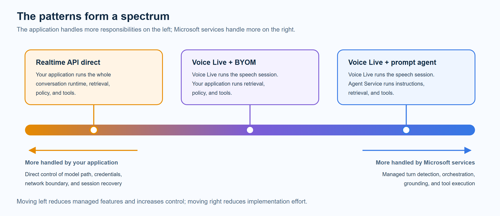</p>
<p align="center"><em>Each step to the right hands another responsibility to a Microsoft service; each step to the left keeps it in your application.</em></p>

The practical question is:

> **How much of the conversation runtime should the application own, and does this workload
> need speech-native response time?**

---

## Pattern 1 — Realtime API direct

Your backend connects directly to a realtime deployment. The API can provide model events
and server-side turn-detection modes. Your application is responsible for configuring and
integrating audio buffering, interruption, playback, reconnection, quotas, policy, and the
complete tool loop.

<p align="center">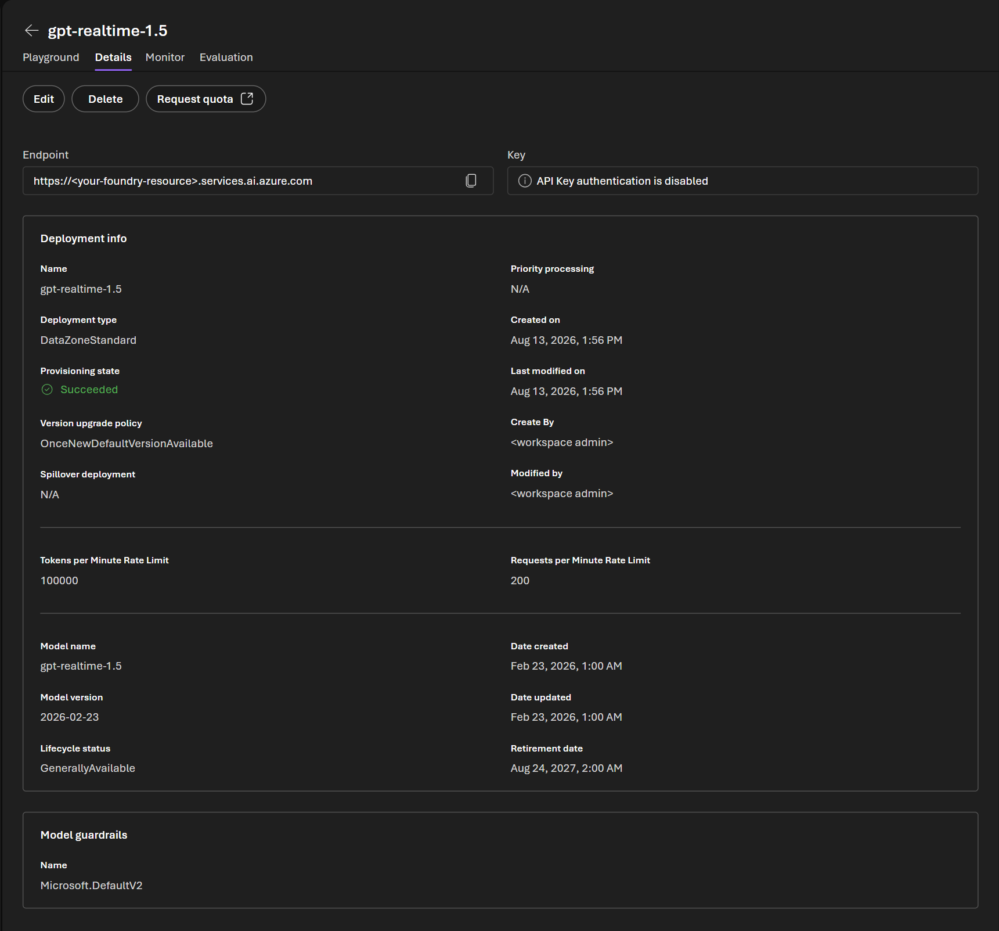</p>
<p align="center"><em>The deployment view exposes type, quota, version, and lifecycle. Where Foundry offers a playground for a model, it validates model turns only; it does not exercise the buffering, interruption, authorization, or reconnect logic implemented by your application.</em></p>

<p align="center">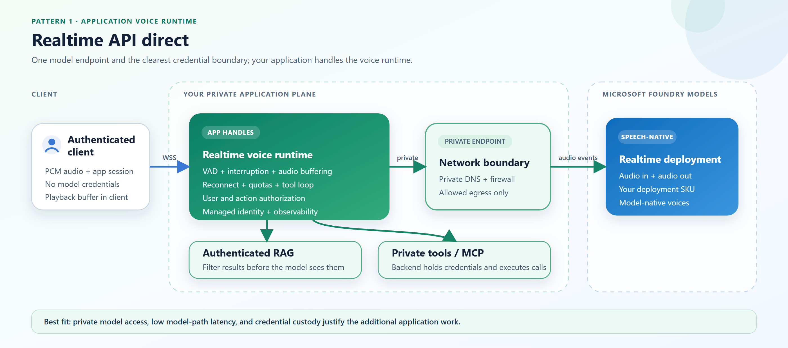</p>
<p align="center"><em>Every boundary in this pattern belongs to your application: client ingress, retrieval, tools, and the model connection.</em></p>

**Choose this pattern when** private model access, credential custody, private tool
reachability, or custom runtime behavior justifies taking responsibility for the voice
runtime. Retrieval and MCP are ordinary backend calls, and credentials remain in your
process.

**Reconsider it when** the team does not want to be responsible for audio quality,
interruption behavior, connection recovery, capacity protection, and production failover.
Azure AI Speech neural and custom voices are not available on this path, and it carries the
largest engineering and operational surface. The shortest model path does not by itself make
a complete voice experience.

---

## Pattern 2 — Voice Live + BYOM

Voice Live handles the speech experience and routes inference to a deployment in your
Foundry environment. Your application remains responsible for browser trust, private data,
user policy, and backend-executed tools.

<p align="center">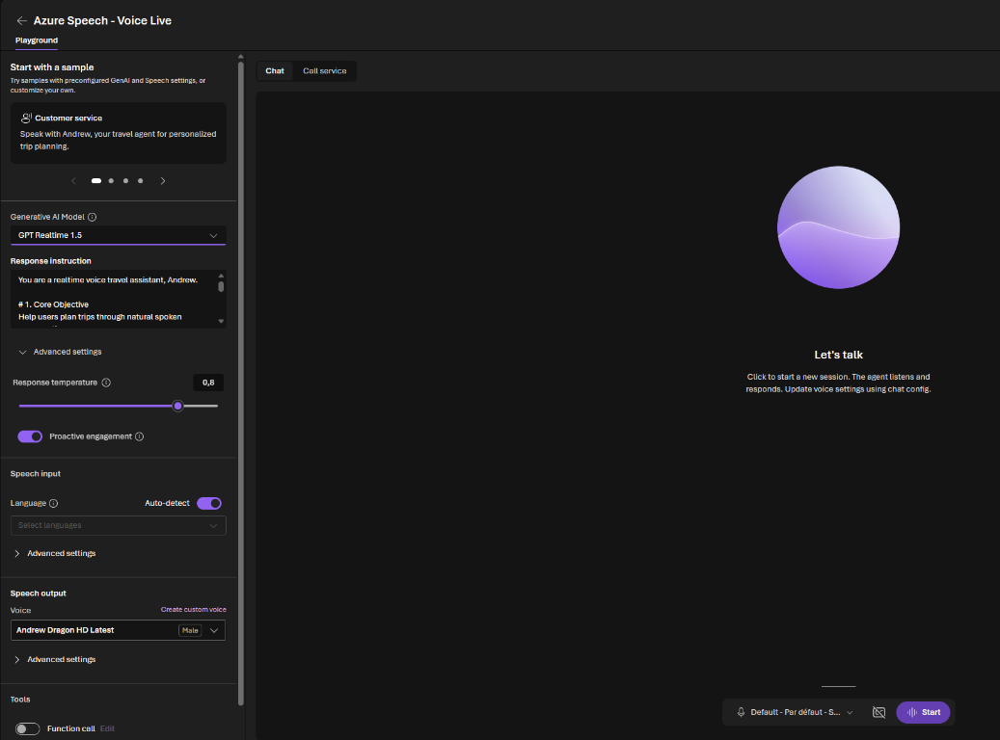</p>
<p align="center"><em>A built-in playground sample is shown here, not the RFP assistant from the companion demo. The playground is useful for tuning speech behavior, voices, and tools with a Voice Live managed model; BYOM routing is selected in the connection configuration, not in this view.</em></p>

<p align="center">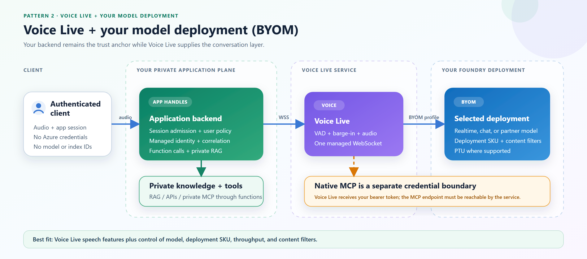</p>
<p align="center"><em>Voice Live sits between the client and your model deployment, so the speech session and any native MCP call cross a managed service boundary.</em></p>

The BYOM connection profile determines whether Voice Live sends the turn to a speech-native
realtime deployment or uses a cascade through a chat or partner model. In both cases, the
model deployment is in your Foundry environment.

### BYOM is three integration modes, not one

| BYOM profile | Example model class | Audio path | Use it when |
|---|---|---|---|
| `byom-azure-openai-realtime` | GPT Realtime | Speech-native | You need realtime latency with Voice Live speech features |
| `byom-azure-openai-chat-completion` | GPT-5 or Grok | Cascaded | You need a chat or partner model behind Voice Live |
| `byom-foundry-anthropic-messages` *(preview)* | Claude Sonnet / Haiku | Cascaded | You need an Anthropic deployment in Foundry |

See the [Voice Live BYOM documentation](https://learn.microsoft.com/en-us/azure/ai-services/speech-service/how-to-bring-your-own-model)
for current profile, model, and region support. BYOM is useful beyond residency: it can
support fine-tuned models, models not predeployed by Voice Live, provisioned throughput
(PTU), and deployment-specific content-safety configuration.

**Choose this pattern when** you want Voice Live to handle speech behavior and Azure AI
Speech voices, while your team controls the model deployment, SKU, capacity, and content
filters.

**Reconsider it when** policy requires every credential and tool call to remain in your
process, or when the only accepted model route is a backend-controlled private endpoint and
the exact Voice Live-to-deployment route cannot satisfy that requirement. Voice Live remains
in the service path, and native MCP requires a service-reachable endpoint that receives
caller-provided authorization across that boundary.

---

## Pattern 3 — Voice Live + prompt agent

Voice Live handles the speech experience. Foundry Agent Service handles instructions,
model selection, retrieval, and the tool loop.

> **Scope:** This comparison covers Voice Live with a Foundry **prompt agent**. Foundry
> **Hosted agents** run custom agent code and represent a separate architecture that is not
> evaluated here. Voice Live can also connect to
> [Hosted agents through the Responses or Invocations protocols](https://learn.microsoft.com/en-us/azure/ai-services/speech-service/how-to-voice-live-hosted-agent-integration);
> that path has a separate runtime, latency, cost, and operating model.

<p align="center">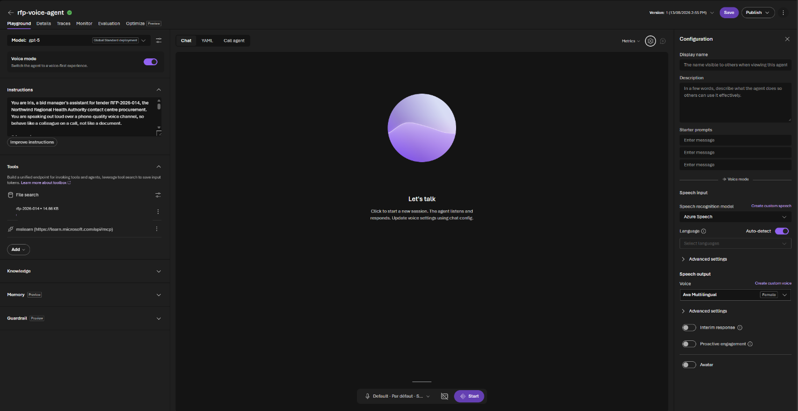</p>
<p align="center"><em>A Foundry prompt agent combines its chat deployment, instructions, File Search, MCP tools, and Voice mode in one configuration. The deployment shown is Global Standard, which is convenient for a demo but is exactly the choice that gate 1 tells you to revisit when residency is a requirement.</em></p>

<p align="center">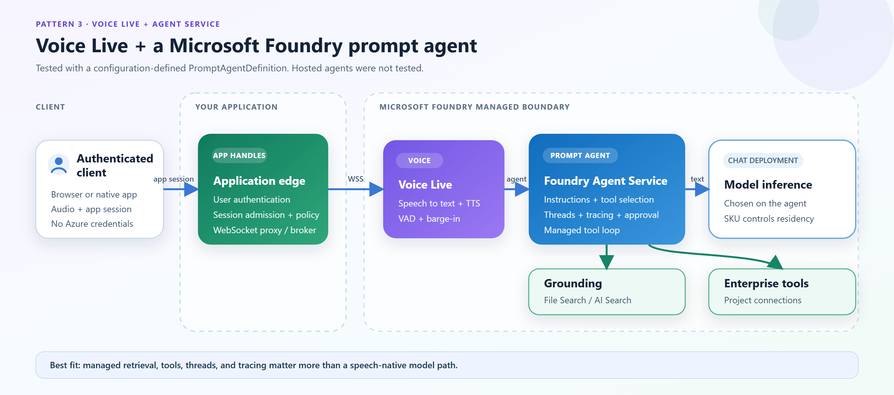</p>
<p align="center"><em>Voice Live and Agent Service cover the speech session, grounding, and the tool loop; your application keeps the user-facing edge and its policy.</em></p>

The model attached to a prompt agent is a **chat** deployment. A realtime deployment cannot
back this agent type: in testing, the `model` and `profile` parameters were accepted and
then silently discarded, and no realtime or audio model appeared anywhere in the session.
The audio path is therefore:

```text
microphone → Voice Live STT → chat deployment → Voice Live TTS → speaker
```

**Choose this pattern when** managed File Search, threads, traces, MCP discovery,
approval events, and automatic tool-loop continuation remove meaningful application work.
Interim responses such as “let me check that” can also improve perceived latency while a
tool runs.

**Reconsider it when** speech-native first-response latency is a hard requirement, the
managed retrieval path cannot enforce caller-specific document access, or the required
network path cannot be demonstrated in the target region and setup. Network isolation is an
account-level decision that must be made when the Foundry account is created, and each tool
attached to the agent has its own traffic path to validate.

---

## Enterprise production requirements — four release gates

The comparison so far covered features, model path, and implementation effort. The four
sections below cover the enterprise production requirements that decide whether a pattern
can ship at all: where each turn is processed, which connections can stay private, who is
authorized to see grounded content, and which credentials cross a service boundary.

Design against these as release gates, not preferences. A managed feature is not a
substitute for evidence that the complete processing and network path satisfies policy. A
pattern that fails one gate is eliminated from the shortlist, regardless of how much
implementation effort it saves.

These four gates expand criteria two through four from the list at the start. Authorization
becomes two gates because grounded content and tool actions fail in different ways: one
returns text the caller should not see, the other performs an action the caller should not
be able to trigger.

---

## Enterprise gate 1 — Data residency

Residency starts with two checks:

1. **Is Voice Live available in the target region?** Start with the official
   [Voice Live region list](https://learn.microsoft.com/en-us/azure/ai-services/speech-service/regions?tabs=voice-live#regions).
2. **Where can the model deployment process the turn?** That answer comes from the model's
   deployment type, not only from the resource region.

| Pattern | Model inference follows | Release gate |
|---|---|---|
| **Realtime API direct** | Your realtime deployment | Select the required deployment type and validate the backend-to-model route |
| **Voice Live + BYOM** | Your selected model deployment | Use `DataZoneStandard` or a Regional deployment when required and supported for the model, SKU, profile, and region |
| **Voice Live + prompt agent** | The agent's chat deployment | Select a Data Zone or Regional chat deployment where available, then validate Voice Live speech processing separately |

Voice Live's own managed models are not uniformly data-zone, and the mapping differs by
region. In France Central at the time of testing, the managed `gpt-realtime` family resolved
to **Global Standard**, while managed `gpt-4o` and most `gpt-5` variants resolved to
**Data Zone Standard**. Do not assume that a managed model inherits the residency of your
resource: check the deployment type for the exact model and region, or use BYOM so the
deployment type is one you choose.

Speech processing, retrieval, storage, tools, transcripts, telemetry, and logs are separate
processing surfaces. Record the region and deployment type for each one. A compliant model
deployment does not make the whole voice system compliant.

---

## Enterprise gate 2 — Private networking

A private data source does not make the whole voice path private. Review each connection:
client to application, application to speech service, application to model, application to
retrieval, service or backend to tools, and every telemetry path.

<p align="center">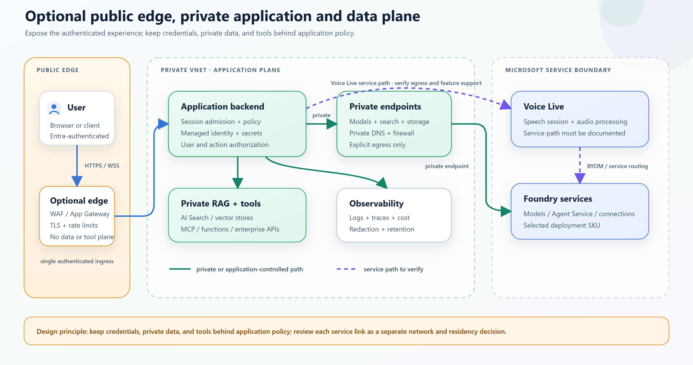</p>
<p align="center"><em>A public, authenticated edge can front a fully private data plane—but every managed service link behind it still needs its own evidence.</em></p>

| Pattern | Application-controlled or private paths | Managed path that still needs evidence | Release gate |
|---|---|---|---|
| **Realtime API direct** | Backend-to-model, retrieval, and tools through private endpoints where supported | Client ingress and any telemetry or external dependency you choose | Validate private DNS, disabled public model access, explicit egress, reconnect behavior, and operational access |
| **Voice Live + BYOM** | Backend, retrieval, backend functions, and private application dependencies | Client/backend-to-Voice Live, Voice Live-to-deployment routing, and any native MCP call | Verify the exact BYOM profile, region, and route before assuming a deployment with public access disabled is reachable |
| **Voice Live + prompt agent** | Backend, private data, Search, Storage, Cosmos DB, and supported project connections | Voice Live-to-Agent Service orchestration and every Agent Service dependency | Select the isolated topology (bring-your-own or managed virtual network) when the Foundry account is created, build its delegated subnet and private endpoints, then test name resolution, traffic, and each attached tool from the deployed environment |

Four rules prevent overclaiming:

- An authenticated, rate-limited public application edge can be acceptable when it exposes
  no private data, credentials, or tool plane. “Public ingress” and “public data plane” are
  not the same statement.
- A private endpoint on one resource does not prove that every managed service link uses
  that endpoint.
- Tool connectivity is part of the network decision. In a Foundry Standard project with a
  bring-your-own virtual network, your data and tool resources, Azure AI Search included,
  are reached through their private endpoints. A toolbox groups several tools but deploys
  no networking of its own, so each tool inherits the project configuration and follows its
  own path. See
  [network isolation for a toolbox](https://learn.microsoft.com/en-us/azure/foundry/agents/how-to/tools/toolbox-network-isolation)
  for the per-tool detail.
- Voice Live is built on Azure AI Speech, but support must be confirmed for the exact
  Voice Live feature and route. Use the
  [Speech Private Link documentation](https://learn.microsoft.com/en-us/azure/ai-services/speech-service/speech-services-private-link)
  as a starting point, not as proof of the complete architecture.

---

## Enterprise gate 3 — Per-user authorized retrieval

Voice RAG has a dangerous failure mode: retrieval can silently return no authorized
results, after which the model answers fluently and incorrectly, out loud, without a result
list the user can inspect.

The architecture must answer **who queries, with whose identity, and where document
entitlements are enforced**.

<p align="center">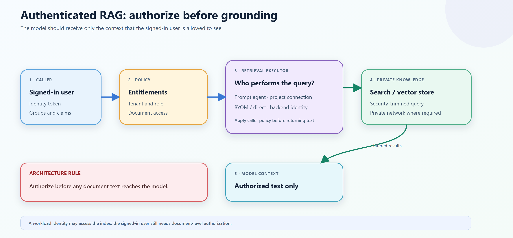</p>
<p align="center"><em>The workload identity opens the data source; the caller's entitlements decide which text may reach the model.</em></p>

| Pattern | Who queries | Retrieval credential | Per-user filtering |
|---|---|---|---|
| **Realtime API direct** | Your backend | Backend managed identity, scoped to Search Index Data Reader | Apply security trimming before returning text to the model |
| **Voice Live + BYOM** | Your backend | Backend managed identity, scoped to Search Index Data Reader | Apply security trimming before returning text to the model |
| **Voice Live + prompt agent** | Foundry Agent Service | Project connection using managed identity or API key | Managed File Search is workload-scoped; use a user-aware tool or MCP connection when results must vary by caller |

A workload identity that may query an index does not mean every caller may see every
document. Managed File Search is a good fit when every authorized user may search the same
corpus. If document access varies by caller, route retrieval through a custom function or
MCP tool. The backend keeps the index credential, evaluates the caller's claims, and
returns only authorized text to the model.

Treat “no authorized results” as an explicit outcome. Log it with the session correlation
ID and either tell the user that no accessible source was found or follow a documented
ungrounded-answer policy. Do not silently broaden the query or fall back to a less
restricted corpus.

Network isolation must cover ingestion as well as query traffic. In a private Agent
Service setup, verify that Search indexers execute through the private environment;
otherwise deployment can appear healthy while the index remains empty.

---

## Enterprise gate 4 — Tool credentials and action authorization

Voice Live supports
[function calling and native MCP](https://learn.microsoft.com/en-us/azure/ai-services/speech-service/how-to-voice-live-mcp-server).
The difference is not syntax—it is execution and credential custody.

<p align="center">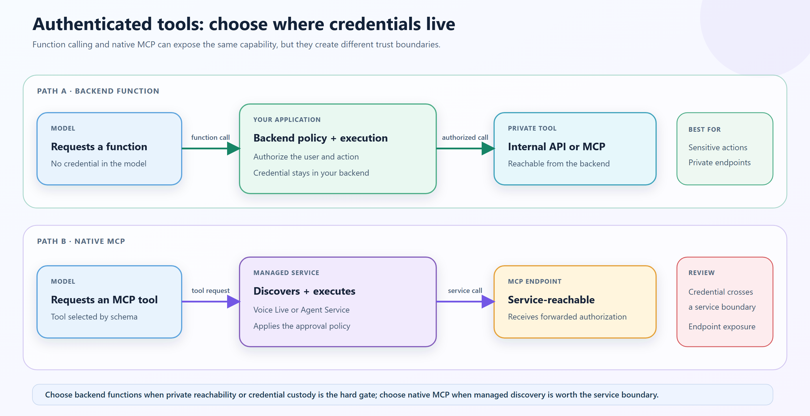</p>
<p align="center"><em>Use the execution path to make credential custody and network reachability explicit.</em></p>

| Aspect | Function calling | Native MCP in Voice Live |
|---|---|---|
| **Tool execution** | Application-side, normally your backend | Server-side, managed by Voice Live |
| **Tool discovery** | You declare schemas | Voice Live discovers tools from the MCP endpoint |
| **Approval** | You build the policy and user experience | `always` (default), `never`, or per-tool |
| **Network reachability** | Whatever your backend can reach | MCP endpoint must be reachable by Voice Live |
| **Credential** | Remains in your backend | Caller-provided authorization or headers are passed to Voice Live |
| **API version** | `2025-10-01` | `2026-04-10` or later |

- With **Realtime API direct**, your backend is the MCP client and can use managed identity,
  OAuth/OBO, or a Key Vault secret while reaching private tools.
- With **Voice Live + BYOM**, Voice Live is the client for native MCP and receives the
  authorization material. Backend functions instead keep credentials in your process.
- With a **Voice Live + prompt agent** setup, Agent Service is the MCP client; project
  connections can use managed identity, agentic identity, OAuth, or a user token for
  on-behalf-of (OBO) authorization.

Treat the tool allow-list as a security boundary: without one, tools added to the server
later can become callable. Automatic execution may be appropriate for low-risk, read-only
operations, but read-only does not automatically mean safe. Writes, spending, privilege
changes, and sensitive reads need application-side authorization and an approval
experience; high-impact actions may also require step-up authentication.

Approval configuration alone is not the user experience. Design how the conversation
states the pending action, waits, handles denial, and avoids replaying a side effect after
reconnect. A prompt agent manages the tool-to-response loop; with native MCP or backend
functions, verify which component continues the turn and requests the spoken answer.

---

## Cost — Count the meters before the tokens

Start with the billing topology. Each managed layer can add a meter, while moving
responsibility into your application adds engineering and operating cost that token counts
do not show:

| Pattern | Cost topology | Primary cost controls |
|---|---|---|
| **Realtime API direct** | Your model deployment + application, data, and tool infrastructure | Model usage, capacity, application runtime, operational effort |
| **Voice Live + BYOM** | Voice Live + your model deployment + backend retrieval and tools | Model and SKU, provisioned throughput, session duration, tool volume |
| **Voice Live + prompt agent** | Voice Live + chat deployment + retrieval and tool services as used | Chat model, retrieved context, session duration, tool volume |

Voice Live itself does not bill at a single rate. Its meter is tiered by model: pro covers
models such as `gpt-realtime`, `gpt-4o`, and `gpt-5`; basic covers the mini variants; lite
covers `gpt-5-nano` and Phi. Confirm which tier applies to a BYOM session before sizing,
because the published tier table enumerates the managed models rather than
bring-your-own deployments.

### A configuration measurement, not a pattern ranking

The following numbers came from one identical question and target answer in the tested
configurations. They are intentionally retained as **billing anatomy**, not as a normalized
price comparison: the prompt-agent path used GPT-5 and managed File Search, while the other
paths used GPT Realtime and backend retrieval.

| Tested configuration | Total tokens | Input | Output text | Output audio | Reasoning detail* |
|---|---:|---:|---:|---:|---:|
| Realtime API direct | 1,851 | 1,640 | 50 | 161 | 0 |
| Voice Live + BYOM | 1,865 | 1,639 | 33 | 193 | 0 |
| Voice Live + prompt agent (GPT-5 + File Search) | 7,207 | 6,324 | 668 | 215 | 576 |

\* Reasoning is reported as detail within the output text tokens, not as an additional
category to add to the total.

Do not divide the last row by the others and call the result a pattern multiplier. That
would confound model choice, reasoning, retrieval implementation, context size, and
response shape. The runs support narrower conclusions:

- Direct and BYOM reported similar usage because they used the same model for the same
  work, but they still cross different billing topologies.
- Direct has one model-inference meter but moves voice-runtime cost into application
  engineering and operations; BYOM adds the Voice Live tier to the deployment in your
  Foundry environment.
- Anthropic BYOM reports model and audio usage separately. Reconcile both in Cost
  Management before sizing.
- File Search chunks dominated the tested prompt-agent input; reasoning dominated its
  reported output.

If commercial requirements favor predictable throughput over per-token billing, PTU on a
deployment in your Foundry environment points toward Voice Live + BYOM or Realtime API
direct.

---

## Latency — A directional test, not a benchmark

In this test, changing the chat model inside one pattern moved p50 by about 2.7 seconds,
while the two speech-native patterns differed by 80 milliseconds. The pattern set the floor;
the model chosen inside it decided most of the rest.

The test was run on 15 August 2026 using ten warm, text-injected, no-tool turns per
configuration on one workstation in France Central. The prompt-agent path was measured
with two chat models to show how much model choice can change the result within the same
pattern. Realtime model versions turn over quickly; check current availability before
reusing these numbers.

<p align="center">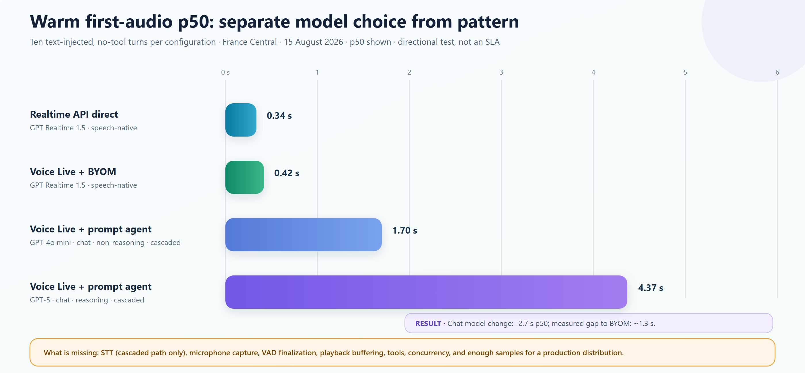</p>
<p align="center"><em>The two prompt-agent bars use the same pattern and the same speech layer; only the chat model behind them differs.</em></p>

| Tested pattern | Model | Warm p50, n=10 |
|---|---|---:|
| Realtime API direct | GPT Realtime 1.5, speech-native | 0.34 s |
| Voice Live + BYOM | GPT Realtime 1.5, speech-native | 0.42 s |
| Voice Live + prompt agent | GPT-4o mini, chat, non-reasoning | 1.70 s |
| Voice Live + prompt agent | GPT-5, chat, reasoning | 4.37 s |

The probe captured p95 values, but ten samples are not enough to present p95 as a reliable
tail-latency statistic. The p50 results support only directional observations:

- The fast prompt-agent configuration remained about 1.3 seconds behind BYOM. That gap
  includes the serial chat-completion and TTS path, plus service, model, and voice
  differences that this test did not isolate.
- BYOM and direct were close in this environment. Their 80 ms difference is not a
  standalone measurement of Voice Live overhead.
- In an earlier exploratory run, retrieval raised the fast prompt-agent path to roughly
  4.7 seconds p50, and session establishment added roughly 4.5 seconds. Tool latency and
  cold connection time need separate budgets.

A critical limitation is asymmetric: text injection excluded STT from every track, but only
the cascaded prompt-agent path has a real STT hop. The true spoken-input gap is therefore
likely larger than the measured 1.3 seconds.

A real customer benchmark should use real microphone audio, the actual client stack,
production retrieval and tools, target region and SKU, realistic concurrency, hundreds of
interleaved turns, and p95/p99. Measure what users feel: **user stopped speaking → agent
started speaking**.

Also measure perceived latency. The tested prompt-agent integration can provide a managed
interim “let me check that” response while a tool runs. A direct integration can play
application-generated status audio, but your runtime must coordinate it with interruption,
tool completion, and the final model response. Four seconds with feedback feels different
from four seconds of silence.

---

## Decision guide — Let the binding constraint choose

Use the same six criteria from the start of the article. Treat a requirement as a hard
gate when the architecture cannot compensate for it elsewhere.

| Criterion | Realtime API direct | Voice Live + BYOM | Voice Live + prompt agent |
|---|---|---|---|
| **Features and effort to build** | Realtime model and protocol; your application handles the complete conversation runtime | Voice Live handles speech; your application handles retrieval, policy, and part of the tool loop | Voice, retrieval, tools, threads, tracing, and approvals are handled by Microsoft services |
| **Data residency** | Your deployment type controls model residency | Your deployment can use Data Zone or Regional SKUs while retaining Voice Live | Inference follows the agent's chat deployment type |
| **Private networking** | Clearest private model and tool boundary, with the most application implementation | Private application and data plane; prove the exact Voice Live-to-deployment and native MCP routes | Most service-side networking configuration; validate Voice Live, Agent Service, and every dependency |
| **Authentication and authorization** | Your backend is responsible for every credential, entitlement check, and tool call | Backend functions keep per-user policy private; native MCP crosses a service boundary | Project connections provide managed identity, OAuth, and OBO patterns |
| **Cost** | Fewest managed meters, but engineering and operating effort becomes the dominant cost | Predictable model spend through your own SKU and capacity, plus the Voice Live tier | Most managed meters, and retrieved context drives model spend |
| **Latency** | Shortest model path; end-to-end latency depends on the voice runtime you build | Speech-native latency with Voice Live speech features | Cascaded path; model choice matters, but speech-native latency is not available |

### Apply the guide in three steps

1. **Mark the non-negotiable requirements.** Examples include a Data Zone deployment,
   Azure AI Speech custom voices, private tool reachability, or a speech-native latency
   target.
2. **Eliminate any pattern that fails a hard gate.** Do not use additional features to
   compensate for a residency, authorization, or network requirement.
3. **Compare effort and cost only among the remaining patterns.** Then benchmark the
   finalists with real audio, retrieval, tools, concurrency, and the target region.

Worked example from the tested tender: Annex D requires a first response under 1.5 s at P95,
M-01 requires EU-only processing, and Annex C bans per-token AI pricing. Latency alone
eliminates the prompt agent, whose p50 of 1.70 s on the faster chat model already exceeds
the P95 target before its STT hop is counted. Residency and pricing then point at a
deployment you control—Data Zone SKU, PTU—which leaves Voice Live + BYOM, with Realtime API
direct as the fallback if the Voice Live route cannot be evidenced. Change one constraint,
such as dropping the latency SLA or requiring every credential to stay in your process, and
a different pattern survives.

If no hard gate separates the finalists, **Voice Live + BYOM is the pragmatic midpoint**:
Voice Live handles speech behavior while you retain deployment control. Choose Realtime API
direct only when credential custody, private reachability, or runtime control justifies
taking responsibility for the voice runtime. Choose a prompt agent when managed retrieval,
threads, tracing, approvals, and automatic tool-loop continuation are requirements.

There is still no universal winner. The best pattern is the least complex one that
satisfies every hard gate—and whose unverified service paths you can close before release.

---

## Get started

Start with the companion demo to exercise all three paths against the same use case, then
use the product documentation to go deeper on the pattern you select.

| Path | Next step |
|---|---|
| **Run and compare all three patterns** | [Companion demo repository](https://github.com/yelghali/live-voice-agent-demo) with setup instructions, the synthetic RFP corpus, and latency/cost probes |
| **Try the direct model path** | [Realtime API over WebSockets](https://learn.microsoft.com/en-us/azure/foundry/openai/how-to/realtime-audio-websockets) |
| **Try Voice Live** | [Voice Live quickstart](https://learn.microsoft.com/en-us/azure/ai-services/speech-service/voice-live-quickstart) |
| **Prepare security review** | [Deployment types](https://learn.microsoft.com/en-us/azure/foundry/foundry-models/concepts/deployment-types) · [Speech regions](https://learn.microsoft.com/en-us/azure/ai-services/speech-service/regions) · [Agent Service networking](https://learn.microsoft.com/en-us/azure/foundry/agents/how-to/virtual-networks) · [Toolbox network isolation](https://learn.microsoft.com/en-us/azure/foundry/agents/how-to/tools/toolbox-network-isolation) · [Speech Private Link](https://learn.microsoft.com/en-us/azure/ai-services/speech-service/speech-services-private-link) |
| **Understand tools** | [MCP with Voice Live](https://learn.microsoft.com/en-us/azure/ai-services/speech-service/how-to-voice-live-mcp-server) · [Foundry Agent Service MCP](https://learn.microsoft.com/en-us/azure/foundry/agents/how-to/tools/model-context-protocol) |

The companion repository is a local reference implementation, not production
infrastructure: it uses developer credentials and does not deploy user authentication or
private networking.

Which of the six criteria becomes the binding constraint in your environment? Share it in
the comments.
