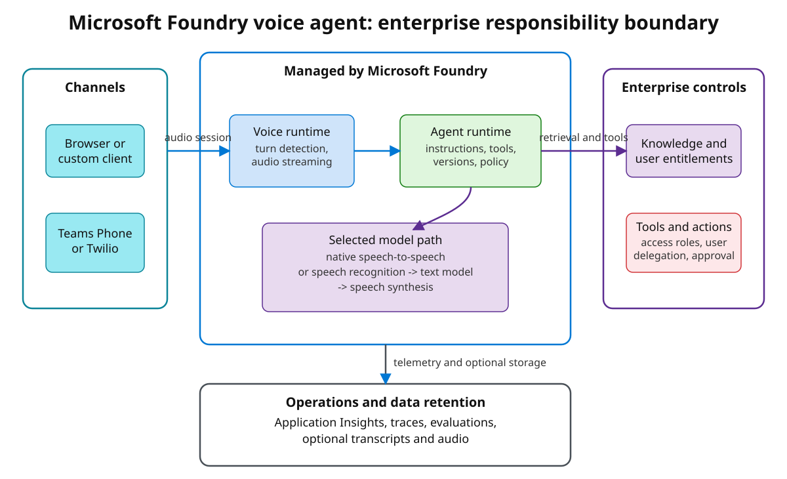
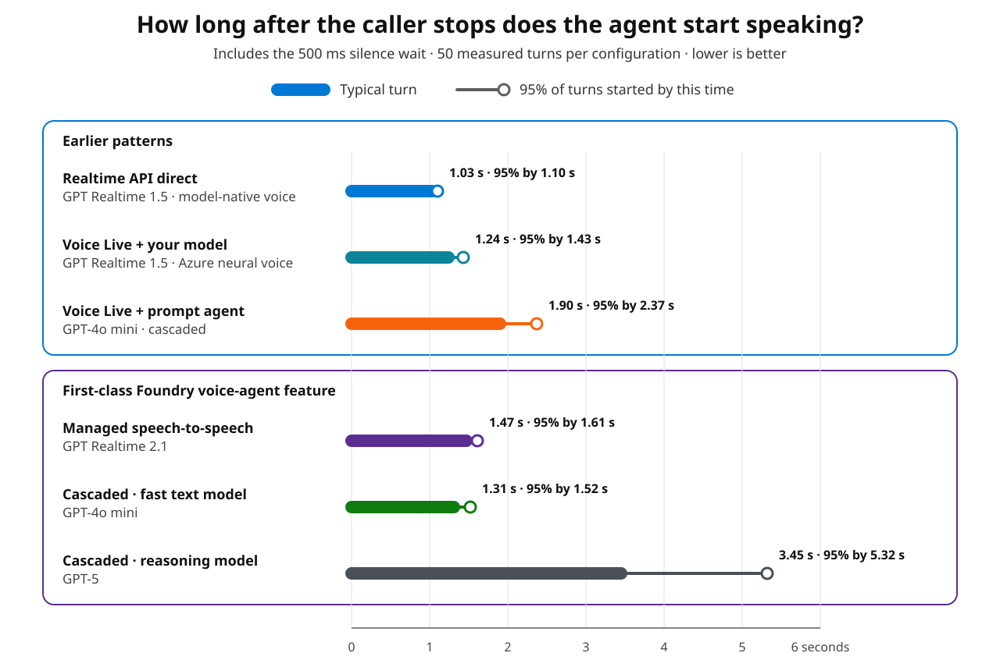

# Microsoft Foundry voice agents: enterprise architecture and real-audio performance

Microsoft Foundry voice agents reduce a multi-service voice solution to a versioned,
managed agent—but they do not remove the identity, data, network, and operations boundaries
around it.

Microsoft's
[launch announcement](https://techcommunity.microsoft.com/blog/azure-ai-foundry-blog/introducing-voice-agents-in-microsoft-foundry/4557276)
introduces the feature and its capabilities: real-time speech, knowledge, tools, channels,
observability, and evaluation in one Foundry experience.

This article addresses a different question: **should an enterprise use the feature as the
starting point for a voice architecture?** It assesses what Foundry manages, which
responsibilities remain with the solution team, and where the important trust and
operational boundaries sit. It uses the same six criteria as my
[earlier comparison of three real-time voice patterns](https://techcommunity.microsoft.com/blog/azure-ai-foundry-blog/choosing-a-real-time-voice-architecture-on-microsoft-foundry-three-enterprise-pa/4552676). That earlier article
covers Realtime API direct, Voice Live with your own model, and the previous prompt-agent
integration; its prompt-agent path is not the first-class API assessed here.
The latency section adds a 300-turn real-audio study across those paths and the new feature,
using the same caller-side timing boundary.

At the time of writing (26 September 2026), voice-based agents are in public preview.
Product statements and measurements in this article were checked on that date.

---

## Executive assessment

The new feature materially reduces the amount of voice infrastructure an application team
must build. A voice agent is now a versioned Foundry Agent Service entity whose definition
can hold the model, instructions, input and output audio settings, turn detection, tools,
interim responses, and storage policy. The application connects to a managed real-time
endpoint instead of assembling a speech pipeline and agent runtime itself.

> **Foundry owns much more of the voice runtime, while the customer remains accountable
> for identity, authorization, data placement, network design, retention, and operational
> fitness.**

| Criterion | Enterprise assessment |
|---|---|
| Features and effort | Strong consolidation of the voice runtime and agent lifecycle; the application and governance layers remain |
| Data residency | No single region setting covers the whole conversation; map speech, model, storage, tools, telemetry, and channel processing separately |
| Private networking | Private networking covers Agent Service and customer-managed dependencies; validate the client, model, telemetry, and telephony paths separately |
| Authentication and authorization | Microsoft Entra ID and agent identities provide strong primitives; caller-specific data and action policy remain application responsibilities |
| Cost | Metering spans audio, model hosting, session time, tools, storage, and optional media; validate the complete workload in Cost Management |
| Latency | Model and turn configuration matter more than the feature label; test real audio and report both typical and slow-turn results |

---

## What is architecturally new?

The new API represents the experience as a
[`VoiceAgentDefinition`](https://learn.microsoft.com/azure/foundry/agents/how-to/configure-voice-agent).
Its `kind` is `voice`, and every create or update operation produces an immutable agent
version behind a stable agent name. The definition selects:

- model hosting, model, instructions, and an optional greeting;
- input audio, transcription, enhancement, and turn detection;
- output audio, voice, language, speed, and optional avatar;
- tools, tool policy, interim responses, and conversation storage.

The runtime is reached over a persistent real-time connection. Foundry Agent Service owns
the agent lifecycle and tool orchestration; Voice Live supplies the speech runtime.

<p align="center"></p>
<p align="center"><em>A managed voice runtime reduces implementation work. It does not merge the identity, data, networking, and retention boundaries around it.</em></p>

### One feature, two model paths

Foundry derives the voice architecture from the selected model.

**Native speech-to-speech**

```text
caller audio -> realtime speech model -> spoken response
```

This path is intended for natural, low-latency conversation. The model consumes and emits
audio directly. Available voice and audio controls depend on the selected model.

**Cascaded text model**

```text
caller audio -> speech recognition -> text model -> speech synthesis -> spoken response
```

This path provides broader text-model and Azure voice choices, plus explicit transcription,
phrase-list, and speech-synthesis controls. It also places serial stages on the critical
latency path.

Service-hosted (`managed`) versus customer-deployed (`self_deployed`) is a separate
decision. It controls where the model is hosted and metered. The model itself determines
whether the resulting path is native or cascaded.

---

## Criterion 1 — Features and implementation effort

This is where the feature delivers its clearest architectural value. Foundry combines the
real-time session, turn taking, transcription, voices, agent versions, models, knowledge,
tools, channels, traces, latency monitoring, evaluation, and optional avatars that
previously crossed several APIs and operational surfaces.

The portal can create and test without application code; client libraries and Azure
Developer CLI make the definition deployable from source control.

### What remains customer-owned

An enterprise still owns the client or approved phone channel, caller admission and abuse
controls, user-specific retrieval and action authorization, approval and duplicate-action
protection for consequential tools, human handoff, retention policy, regression testing,
capacity, and incident management.

Channel support is narrower than generic agent publishing. The current documentation lists
Teams Phone extensibility and Twilio for phone numbers. Standard Microsoft Teams or
Microsoft 365 agent publishing is not a substitute for a Teams Phone integration.

The practical change is therefore a shift from **building the voice runtime** to
**configuring and governing a managed voice runtime**.

---

## Criterion 2 — Data residency

Data residency cannot be answered with one region field. A voice turn crosses multiple
processing and storage surfaces:

| Surface | Residency question |
|---|---|
| Speech and model | Where are turn detection, recognition, synthesis, and model inference processed? Is the model global, data-zone, or regional? |
| Agent state and conversations | Where is service state stored? Is `store` enabled for transcripts and raw audio? |
| Knowledge and tools | Where are files, indexes, retrieved passages, tool requests, and outputs processed? |
| Observability | Where does Application Insights store telemetry, and is sensitive-content capture enabled? |
| Channel | What additional processing is introduced by Azure Communication Services, Teams Phone, or Twilio? |

The
[Voice Live data-privacy documentation](https://learn.microsoft.com/azure/foundry/responsible-ai/speech-service/voice-live/data-privacy-security)
says that Voice Live itself does not retain customer data by default, but connected
features can. If a customer opts into support logging, Microsoft can retain the relevant
speech data in the resource region for up to 30 days.
[Agent Service documentation](https://learn.microsoft.com/azure/foundry/responsible-ai/agents/data-privacy-security)
places data stored by stateful service features at rest in the Azure OpenAI resource
geography; model inference and tools follow their own configuration and hosting location.

For a `self_deployed` configuration, model inference follows the selected Global, Data
Zone, or regional deployment type; that choice does not determine the location of speech,
storage, tools, or channels. A `managed` configuration uses a service-hosted model, so do
not infer its processing boundary from the project region.

The performance lab for this article used a France Central Foundry project, but its
`gpt-4o-mini` and `gpt-5` test deployments were Global Standard. The lab is evidence about
latency, **not** evidence of EU-only processing.

---

## Criterion 3 — Private networking

Foundry Agent Service supports a network-secured Standard setup with a delegated subnet,
private endpoints, customer-provided Azure Storage, Azure AI Search, and Azure Cosmos DB,
and public network access disabled. The project managed identity receives data-plane access
to those dependencies. That is the starting point, not proof that a voice solution is
private end to end. Review these paths independently:

| Connection | What must be demonstrated |
|---|---|
| Client to voice-agent endpoint | Private DNS, successful real-time connection setup, reachability, and idle-timeout behavior from the deployed client environment, or an authenticated public edge |
| Voice runtime to selected model | The exact managed or self-deployed route used by the chosen voice configuration |
| Agent to data and tools | Private endpoints, DNS, role-based access control, route, credentials, and successful runtime access |
| Telemetry and telephony | Approved Application Insights egress plus provider-specific media and signaling paths |

The
[Agent Service private-networking guide](https://learn.microsoft.com/azure/foundry/agents/how-to/virtual-networks)
documents the general private setup. It does not make a private endpoint on one resource
proof of every voice-specific managed hop.

The test environment used for the latency measurements had public network access enabled.
No private-network performance or reachability claim is made from that experiment.

---

## Criterion 4 — Authentication and authorization

Voice-agent security is easier to reason about as four identity layers:

1. **Caller identity.** Access to the hosted web experience can be assigned to
   organizational users and groups. A custom client still needs sign-in, session
   admission, rate limiting, and business entitlements.
2. **Session invocation identity.** The current integration uses Microsoft Entra
   authentication. Applications should use an appropriate workload identity and must not
   put long-lived credentials in browser code.
3. **Agent identity.** The
   [Foundry agent-identity model](https://learn.microsoft.com/azure/foundry/agents/concepts/agent-identity)
   also applies to voice agents and authenticates downstream tools. Publishing an agent as
   a general Agent Application creates a distinct identity, so project permissions do not
   automatically transfer.
4. **Delegated user identity.** For attended scenarios, OAuth on-behalf-of flows let a
   downstream service evaluate both the agent identity and the user's delegated
   permissions.

A valid token proves identity; it does not prove that a requested action is safe.
An agent might be allowed to query an index while the caller can see only some documents,
or it might be able to call a tool that the caller cannot authorize. Apply the caller's
document permissions before content reaches the model. For consequential actions, require
application policy, step-up verification where needed, spoken confirmation, and
duplicate-action protection so a reconnect cannot repeat a side effect. Do not treat a
recognized voice or a phone number alone as proof of identity.

---

## Criterion 5 — Cost

There is now official
[pricing guidance for voice-based agents](https://learn.microsoft.com/azure/foundry/agents/concepts/voice-agent-pricing),
but it is more useful as billing anatomy than as a durable price table.

Five documented factors drive cost:

1. Audio input and output tokens.
2. Managed versus self-deployed model hosting.
3. Connected session duration.
4. Tool calls and the services behind them.
5. Optional features such as avatars and stored conversations.

The complete architecture can also include speech recognition and synthesis, custom voice
hosting, Application Insights, Azure Storage, Azure AI Search, Azure Cosmos DB, telephony,
application ingress, identity, and network infrastructure.

With `model_type: managed`, model usage lands on the managed voice-agent service. With
`model_type: self_deployed`, model usage lands on the customer's model deployment and can
use that deployment's standard or provisioned capacity model.

Voice traces can expose token usage and estimated-cost attributes while a system is being
tuned. Microsoft explicitly states that these are estimates, not invoice records; Azure
Cost Management remains the billing source of truth.

### Why this article has no dollar estimate

Microsoft publishes current rates, but a single per-conversation figure would be
misleading. Region, agreement, model, audio volume, session duration, tools, and optional
services all change the result.

A synthetic dollar figure would create false precision. Capture per-turn usage and session
duration, reconcile the actual resource charges in Cost Management, then model realistic
call length, concurrency, transfers, and retries. Include operational cost: the managed
feature removes voice-runtime code, not governance, identity, networking, or channel
operations.

---

## Criterion 6 — Latency

The caller notices one latency measure: **after I stop talking, how long until the agent
starts speaking?** The model path sets the processing stages, but model choice,
turn-detection settings, network distance, tools, retrieval, response length, and channel
buffering determine the result.

### What was measured

The companion harness reran the three earlier patterns and the new feature through one
real-audio test:

- Realtime API direct and Voice Live with your own model used the same customer-deployed
  `gpt-realtime-1.5` model.
- The earlier Voice Live + prompt-agent path and the new cascaded voice agent both used
  `gpt-4o-mini`, the same Azure neural voice, and no tools. This is the closest
  architecture-controlled pair.
- The new feature also ran with managed `gpt-realtime-2.1` and cascaded `gpt-5`.

Every path received the same 1.33-second “Say hello briefly” recording at real-time speed,
the same short-answer instruction, and the same requested server-side turn-detection
settings, including a 500-millisecond silence wait. Each configuration ran 50 measured
turns across five fresh sessions, with one excluded warm-up per session and randomized
sequential order. Knowledge and tools were disabled, and the first-class agents did not
store conversations.

The headline clock starts when the caller finishes speaking and stops when the first
response audio reaches the client:

- **Typical turn** is the median: half the turns were faster and half were slower.
- **95% by** is the slow-end result: only one turn in twenty was slower.

<!-- BENCHMARK_RESULTS_START -->

<p align="center"></p>
<p align="center"><em>Time from when the caller finishes speaking until response audio reaches the client. Lower is better; results are specific to this test environment.</em></p>

| Architecture and configuration | Typical turn | 95% started by |
|---|---:|---:|
| Earlier pattern — Realtime API direct, `gpt-realtime-1.5` | **1.03 s** | **1.10 s** |
| Earlier pattern — Voice Live with your own model, `gpt-realtime-1.5` | 1.24 s | 1.43 s |
| Earlier pattern — Voice Live + prompt agent, `gpt-4o-mini` | 1.90 s | 2.37 s |
| New feature — managed `gpt-realtime-2.1` | 1.47 s | 1.61 s |
| New feature — cascaded `gpt-4o-mini` | 1.31 s | 1.52 s |
| New feature — cascaded `gpt-5` | 3.45 s | 5.32 s |

All 300 measured turns completed with response audio and the expected transcription.

The same-model-and-voice cascade comparison is the most informative result. The
first-class `gpt-4o-mini` voice agent started 0.59 seconds sooner on the typical turn and
0.85 seconds sooner at the 95% boundary than Voice Live with the no-tool prompt agent.
That is an observed end-to-end difference between these configurations; it does not reveal
which internal stage produced it.

Realtime API direct was fastest in this environment. Voice Live with your own model was 0.21 seconds
behind on the typical turn and 0.32 seconds behind at the 95% boundary. Both used the same
realtime deployment, but the direct path used its model-native voice while Voice Live used
an Azure neural voice. The difference therefore measures the configured stacks, not Voice
Live overhead in isolation.

Within the new feature, managed `gpt-realtime-2.1` and cascaded `gpt-4o-mini` were close
enough that this run should not establish a permanent ordering between them. Changing the
cascade to `gpt-5` had a much larger effect, raising the typical result from 1.31 to
3.45 seconds. Model choice remains part of the architecture decision.

Fresh-session readiness ranged from 3.72 to 21.37 seconds across 30 connections. Treat
connection startup as a separate budget: show connection state or connect before the first
turn.

<!-- BENCHMARK_RESULTS_END -->

### Why service monitoring can show sub-second results

The **Overall latency** chart in the
[Foundry voice-agent monitoring view](https://learn.microsoft.com/azure/foundry/agents/concepts/voice-agent-observability)
measures time to first audio **after** voice activity detection decides the caller has
finished. The benchmark chart starts earlier—when the caller actually stops speaking—and
therefore includes the configured half-second silence wait.

Using that later service boundary:

- Managed speech-to-speech was typically 0.88 seconds, with 95% of turns starting by
  1.02 seconds.
- The `gpt-4o-mini` cascade was typically 0.78 seconds, with 95% starting by 0.99 seconds.
- The `gpt-5` cascade was typically 2.92 seconds, with 95% starting by 4.78 seconds.

Both clocks are valid, but they answer different questions. The chart uses the caller's
clock because it better represents the experience a user feels. The later service boundary
explains how an operational metric can be sub-second even when caller-side time exceeds one
second: the caller view adds the time required to detect the end of the turn and deliver
audio across the network.

### How this relates to the earlier measurements

The [earlier three-pattern article](https://techcommunity.microsoft.com/blog/azure-ai-foundry-blog/choosing-a-real-time-voice-architecture-on-microsoft-foundry-three-enterprise-pa/4552676)
reported ten warm, text-injected turns. Those
values still describe model, tool, and synthesis behavior after a response was requested,
but they exclude real speech and end-of-turn detection. Do not compare them numerically
with this chart. The unified rerun above is the cross-pattern comparison because every path
now uses the same audio, caller-side timing boundary, warm-up policy, sample count, region,
network, and no-tool workload.

### Test scope and reproduction

The test includes real speech, end-of-turn detection, model processing, and returned audio.
It excludes device buffering, telephony, tools, retrieval, concurrency, private networking,
and a production client, so its results describe this environment rather than a universal
target.

For reproduction, see the [unified benchmark
harness](https://github.com/yelghali/live-voice-agent-demo/blob/main/scripts/bench_voice_patterns_audio.py),
[benchmark-only prompt-agent
provisioner](https://github.com/yelghali/live-voice-agent-demo/blob/main/agent/create_voice_benchmark_agent.py),
[first-class voice-agent
provisioner](https://github.com/yelghali/live-voice-agent-demo/blob/main/agent/create_foundry_voice_agents.py),
[audio
generator](https://github.com/yelghali/live-voice-agent-demo/blob/main/scripts/generate_voice_benchmark_audio.ps1),
[raw turn data and
method](https://github.com/yelghali/live-voice-agent-demo/blob/main/docs/benchmarks/voice-patterns-real-audio-2026-09-26.json),
and [editable chart
source](https://github.com/yelghali/live-voice-agent-demo/blob/main/docs/diagrams/voice-patterns-real-audio-latency.excalidraw).

---

## Enterprise architecture checklist

For a workload decision, confirm:

- **Platform fit:** the region supports the selected model, voice, audio features, tools,
  and channel, and service quotas cover the expected concurrency.
- **Data and network:** every processing and storage location is recorded, and every route
  works from the intended client and network topology.
- **Identity and authorization:** callers are authenticated, retrieval respects their
  document permissions, and tool identity, delegation, approval, and duplicate-action
  protection are tested.
- **Retention:** conversation storage, trace capture, audio access, deletion, consent, and
  legal retention are approved.
- **Performance:** real audio, tools, target network, concurrency, and objectives for both
  typical turns and the slowest 5% are tested.
- **Operations:** quotas, errors, reconnects, handoff, dependency outages, monitoring, and
  rollback are rehearsed.

---

## Verdict

For a new enterprise voice solution on Microsoft Foundry, **first-class Foundry voice
agents should be the primary option to evaluate**. They make voice a managed, versioned
agent lifecycle and bring the runtime, channels, traces, monitoring, and evaluation
together. That is a materially better starting point than rebuilding those layers by
default.

This is not a claim that the feature is always faster or cheaper. Direct Realtime was
fastest in this test, while the `gpt-5` result showed how strongly model choice can dominate
the outcome. Nor does the managed feature remove the surrounding trust boundaries:
identity, authorization, data placement, networking, retention, and operational fitness
still require an enterprise design.

The earlier patterns therefore remain valid, but for a new build they should be deliberate
alternatives rather than the default starting point:

> **Start with the first-class Foundry voice-agent feature. Keep it when its region, model,
> voice, channel, identity, data, network, cost, and measured performance fit the workload.
> Move to Realtime API or lower-level Voice Live patterns only when a documented requirement
> needs control, capability, or a processing boundary that the first-class definition does
> not provide.**

For the lower-level alternatives and the trade-off between owning the runtime and consuming
managed layers, see the
[earlier three-pattern architecture comparison](https://techcommunity.microsoft.com/blog/azure-ai-foundry-blog/choosing-a-real-time-voice-architecture-on-microsoft-foundry-three-enterprise-pa/4552676).
For Microsoft's feature
overview and product direction, read the
[launch announcement](https://techcommunity.microsoft.com/blog/azure-ai-foundry-blog/introducing-voice-agents-in-microsoft-foundry/4557276).

---

## Sources

- [Introducing voice agents in Microsoft Foundry](https://techcommunity.microsoft.com/blog/azure-ai-foundry-blog/introducing-voice-agents-in-microsoft-foundry/4557276)
- [Agents in Microsoft Foundry](https://learn.microsoft.com/azure/foundry/agents/overview)
- [Create a voice-based prompt agent](https://learn.microsoft.com/azure/foundry/agents/quickstarts/prompt-voice-agent)
- [Configure a voice agent](https://learn.microsoft.com/azure/foundry/agents/how-to/configure-voice-agent)
- [Voice-agent design best practices](https://learn.microsoft.com/azure/foundry/agents/concepts/voice-agent-best-practice)
- [Voice-agent tracing, monitoring, and evaluation](https://learn.microsoft.com/azure/foundry/agents/concepts/voice-agent-observability)
- [Pricing for voice-based agents](https://learn.microsoft.com/azure/foundry/agents/concepts/voice-agent-pricing)
- [Foundry Agent Service regions and limits](https://learn.microsoft.com/azure/foundry/agents/concepts/limits-quotas-regions)
- [Private networking for Foundry Agent Service](https://learn.microsoft.com/azure/foundry/agents/how-to/virtual-networks)
- [Agent identity concepts](https://learn.microsoft.com/azure/foundry/agents/concepts/agent-identity)
- [Data, privacy, and security for Voice Live](https://learn.microsoft.com/azure/foundry/responsible-ai/speech-service/voice-live/data-privacy-security)
- [Data, privacy, and security for Agent Service](https://learn.microsoft.com/azure/foundry/responsible-ai/agents/data-privacy-security)
- [Publish and share a voice-based agent](https://learn.microsoft.com/azure/foundry/agents/how-to/voice-agent-channels-publish)
- [Integrate telephony channels with a voice agent](https://learn.microsoft.com/azure/foundry/agents/how-to/voice-agent-telephony-channels)
